# [The Stellar Consensus Protocol: A Federated Model for Internet-level Consensus](https://www.stellar.org/papers/stellar-consensus-protocol.pdf)

# 스텔라 합의 프로토콜: 인터넷 레벨 합의를 위한 연합형 모델

본 논문은 연합형 비잔틴 합의(FBA)라는 새로운 합의 모델을 소개한다. FBA는 쿼럼 슬라이스를 통하여 안정성을 달성하게 된다. 즉 각 노드가 만드는 개개의 신뢰성 결정을 하나로 합하여 시스템 레벨의 쿼럼을 결정한다. 슬라이스들은 현재 인터넷을 묶고 있는 개별 네트워크 피어링 및 트랜짓 결정보다 더 강력하게 시스템을 하나로 결합한다. 

또한, FBA의 구현체인 스텔라 합의 프로토콜(SCP)도 설명한다. SCP는 모든 비잔틴 합의 프로토콜과 마찬가지로 공격자가 합리적인 행동을 한다는 가정을 세우지 않는다. 만장일치로 승인된 회원 목록을 전제로 했던 과거의 비잔틴 합의 모델과 다르게, SCP는 유기적인 네트워크 성장을 진작시키는 개방 회원제를 이용한다. 탈중앙적인 작업증명 및 지분증명 방식 등과 비교할 때, SCP는 적절한 수준의 컴퓨팅 및 자본 요구조건만 부과하며, 잠재적으로 진입장벽을 낮추고 신규 참여자의 금융 시스템 이용 가능성을 열어 놓습니다.

CCS 개념: • 보안 및 개인정보 → 분산 시스템 보안; 보안 프로토콜;

추가 키워드 및 문구: 비잔틴 장애 허용, 비동기 시스템

## 1. 개요

현행 금융 인프라는 완전히 폐쇄적인 시스템이다. 이처럼 시스템이 고립되어 있으므로 처리비용은 많이 들고 [Provost 2013], 지정학적 경계를 넘어갈 때 돈은 느리게 움직인다. [Banning-Lover 2015; CGAP 2008]. 이런 난점이 금융 서비스 성장을 방해했고, 수 십억의 사람들이 금융 서비스를 이용하지 못하게 한다. [Demirguc-Kunt et al. 2015].

이 문제를 해결하려면 인터넷의 성공사례처럼 유기적인 성장과 혁신을 지원하면서, 이와 동시에, 안전한 금융 거래도 보장하는 금융 인프라가 필요하다. 역사적으로 보면, 안전성 확보를 위해 높은 진입장벽을 이용했다. 사람들은 오래된 금융기관을 신뢰하고 (또한 )이들을 규제하기 위해 온갖 노력을 다한다. 그러나, 이같은 독점 상황은 유기적인 성장에 방해가 된다. 성장을 달성하려면 새롭고 혁신적인 참여자가 필요하다. 이들은 적절한 수준의 자본과 컴퓨팅 능력만 있으면 된다.

전세계 금융 네트워크는 모두에게 개방되어야 하며, 이로써 새로운 기업이 참여하여 소외된 사람들도 금융 서비스를 받을 수 있어야 한다. 이러한 네트워크를 만들려면 참여자들의 올바른 금융거래 기록이 보장되어야 한다는 난점을 극복해야 한다. 금융 시장의 진입장벽이 낮으면, 사람들은 사업자들이 스스로를 규제하는것을 믿지 않을 것이다. 세계화와 함께, 사업자들 모두가 다 하나의 개체가 네트워크를 운영하는 것을 신뢰하진 않을 것이다. 이에 유용한 대안은 탈중앙적 시스템이라고 볼 수 있다. 이 시스템에서는 참여자가 협력을 통하여 안전성을 확보한다. 즉, 상호간 금융거래의 유효성에 대해서 합의를 한다. 이런 합의는 전세계적인 합의 메커니즘을 이용한다.

본 논문은 전세계적인 합의에 적합한 모델로 연합형 비잔틴 합의 (FBA) 방법을 제시한다. FBA에서 각 참여자는 자신이 중요하다고 여기는 다른 참여자들에 대해 알고 있다. 이 방법에서 참여자가 하나의 금융거래을 완료된 것으로 판단하려면 다른 중요 참여자들 대부분이 그 거래에 대해 합의를 해줄 때까지 기다려야 한다. 결과적으로는 다른 중요 참여자들도 자기가 보기에 중요한 참여자라고 여기는 참여자들이 합의할때까지 그 거래에 대해서 합의를 해주지 않는다. 결국엔 충분한 숫자의 네트워크가 금융거래를 수락하므로 공격자가 해당 금융거래를 돌이키게 할 수 없게 된다. 이러한 과정 후에만 어떠한 참여자도 금융거래가 안전하다고 간주한다. FBA 합의 방식은 금융 네트워크의 온전함을 보장한다. 이런 탈중앙적인 조정 방식은 유기적 성장의 원동력이 된다.

본 논문은 FBA의 구조인 스텔라 합의 프로토콜(SCP)도 함께 제시한다. 본 논문은 SCP의 안정성이 합의 보장을 인정하는 그 어떤 노드-장애 시나리오 하에서도 합의를 보장하기 때문에 SCP의 안전성이 비동기 프로토콜에 최적화 돼있다고 증명한다. 

본 논문은 참여자의 문제/장애(failures)로 인하여 신뢰 의존성에 대한 충족이 불가능한 경우가 아니라면 SCP에는 합의가 더 이상 불가능해지는 막힘/중단된 상태로 부터 자유롭다고 판단한다. SCP는 다음의 주요 특징 네 가지를 동시에 충족하면서 입증 가능한 최초의 안전 합의 방법이다:

탈중앙적 통제. 합의를 하려면 누구의 허가가 필요한지 명령하는 중앙 기관은 없다. 그러므로 모두가 참여할 수 있다.
빠른 속도. 실제로, 웹 또는 입출금 금융거래 시 노드는 사람이 예상하는 시간 이내에 합의에 도달한다. 즉, 아무리 늦어도 몇 초면 된다.
유연한 신뢰성. 유저/사용자는 자기가 적절하다고 판단하는 그 어떠한 참여자의 조합도 신뢰할 자유가 있다. 예를 들어, 대규모 기관의 신뢰성 확보/정직함 유지에 있어서 소규모 비영리 단체가 중요한 역할을 할 수 있다.
점근적 보안. 안전성은 디지털 서명과 해시 패밀리에 달려있다. 디지털 서명과 해시 방법의 파라미터 들은 압도적인 컴퓨팅 성능을 지닌 공격자에 대항하기 위해 현실적으로 상황에 맞게 조정 할 수 있다.
SCP 응용분야는 금융시장을 넘어서서, 기업이 중요한 활동을 성실하게 수행하도록 보장하기도 한다. 인터넷에서 실질적으로 가장 중요한 역할을 하는 인증기관(CA)들을 예로 들 수 있다. 과거엔 인증기관들이 올바르지 않은 인증서에 서명하고, 이것은 불법적으로 사용 됐던 사례가 있었다. [Microsoft 2013; Langley 2015]. 인증서의 투명성을 통해서 몇가지 제안들이 이 문제를 다루려고 했다.[Kim et al. 2013; Laurie et al. 2013; Basin et al. 2014; Melara et al. 2014]. 인증서 투명성은 사용자가 발급된 인증서의 이력을 확인할 수 있게하고, CA가 이전의 키에 대한 보증/승인 없이 발급된 인증서를 사용하는 단체의 공개키 변조를 시도했는지 알 수 있다. SCP는 인증서 투명성 핵심 요건으로 인증서 이력을 삭제하지 못하도록 강화할 수 있는 방법이 있다. 인증서의 히스토리에 대해서 (탈중앙화된) 각각의 감사들 간의 전세계적인 합의를 요구하므로 과거에 발행한 인증서를 번복하거나 무시하기가 어렵게 된다.

다음 섹션에서는 합의에 대한 기존의 접근법에 대해 논의한다. 
섹션 3에서는 연합형 비잔틴 합의(FBA)를 정의하고, FBA 모델에서 적용할 수 있는 안전성과 활동성 개념을 소개한다. 
섹션 4에서는 SCP의 보안 목표을 설정하는 FBA 시스템의 최적 (장애/고장) 복원성을 설명한다. 
섹션 5에서는 SCP 프로토콜의 핵심 구성요소인 연합투표에 대한 얘기를 전개한다.
섹션 6에서는 막힌상태 (Blocked state )로부터의 안전과 자유도를 검증하는 SCP 자체에 대해 기술한다. 
섹션 7에서는 SCP의 한계에 대해서 설명한다. 
마지막으로, 섹션 8에서는 결론을 요약한다. 수학적 표기법이 낯선 독자를 위해서 본 논문에 나오는 기호 중 일부에 대한 설명을 부록 A에서 제시한다.

## 2. 관련작업

그림 1은 과거 합의 메커니즘과 SCP 가 어떻게 다른지에 대해서 요약한다. 가장 유명한 탈중앙적 합의 메커니즘은 비트코인(Bitcoin)이 발전시킨 작업증명 (proof of work) 개념이다 [Nakamoto 2008]. 
비트코인은 양면적인 접근법으로 합의를 도출한다. 우선, 합리적인 행위자가 선량하게 행동하도록 인센티브를 부여한다. 두 번째, 작업증명(PoW) [Dwork and Naor 1992] 알고리즘을 사용하여 트랜잭션을 결정한다. 
이 알고리즘은 시스템의 컴퓨팅 성능의 대다수를 보유하지 못한 악의적으로 행동하는 행위자에 대한 대비책으로 설계됐다. 비트코인은 탈중앙화 합의의 매력을 압도적으로 입증했다. [Bonneau et al. 2015].

그러나 , 작업증명 (PoW) 방법에는 단점도 있다. 우선, 자원을 낭비한다. 2014년 추정에 따르면, 비트코인은 아일랜드 국가 전체와 동일한 수준의 전력을 소비한다 [O’Dwyer and Malone 2014]. 
두 번째, 몇분에서 몇십분에 이르는 합의 도출 지연으로 인해 안전한 금융결제가 어렵다 [Karame et al. 2012]. 마지막으로, 전통적인 암호 프로토콜과 달리 작업증명법에는 점근적 보안 대책이 없습니다. 
비합리적인 (또는 합의를 방해하려는 외부의) 공격자가 있다고 가정할 경우, (공격자의) 작은 컴퓨팅 파워의 이점은 (시스템의) 보안 전제를 무효화 할 수 있으므로 소위 말하는 "51 % 공격"으로 (트랜잭션) 기록을 다시 쓸 수 있습니다.

더 나쁜 단점은, 초기에 50% 미만의 컴퓨팅 능력(컴퓨테이션)을 통제하는 공격자가 시스템을 조작하여 ( 공격에 )동참하는 참여자들에게 편향된 보상을 제공하게 해서 [Eyal and Sirer 2013]. 과반수의 통제를 취득할 잠재적인 가능성도 있다는 것입니다. 
첨단 디지털 통화인 비트코인은 최고의 컴퓨팅 능력이 뒷받침되므로 "51% 공격"에 대한 방어 방법을 (충분히) 누릴 것입니다. 그러나, 소규모 시스템들은 지금까지 피해를 보았고 [crazyearner 2013; Bradbury 2013] 
이는 비트코인 블록체인을 기반으로 하지 않는 작업증명 시스템들에게는 문제가 됩니다.

 작업증명에 대한 다른 대안 중 하나는 지분증명(PoS)입니다 [King and Nadal 2012]. PoS의 경우, 합의를 이루는 것은 담보를 (원장에 )_등록한 참여자에게 달려있습니다.. PoW와 마찬가지로 보상은 합리적인 참여자들이 프로토콜을 따르도록 권장합니다. 
또한 일부(합의) 계획들은 추가적으로 악의적인 행동에 벌칙을 부과하기도 합니다 [Buterin 2014; Davarpanah et al. 2015]. PoS는 이른바 “nothing at stake” (아무런 지분이 없음 ) 공격이 발생할 가능성이 있습니다. 
이 공격은 과거에 담보를 ( 원장에) 등록하고 그 후 현금화하여 돈을 썻지만 (담보를 원장에 등록한 ) 그룹이 그 지분을 여전히 지니고 있던 시점으로 돌아가서 (그룹의 담보가 여전히 있는것처럼 ) 기록을 조작할 수 있습니다. 
이런 공격을 줄이기 위해서 시스템은 지분증명과 작업증명을 효과적으로 결합하는데, 이는 필요한 작업을 지분과 비례하게 줄이거나, 어떤 다른 합의 매커니즘 (종종 비공식적인) 이 취소할 수 없는 체크포인트를 만들 수 있는 충분히 긴 시간 동안 담보 상환을 지연시킵니다.

또 다른 작업 증명에 대한 또 접근법은 비잔틴 합의입니다. [Pease et al. 1980; Lamport et al. 1982]. 이 비잔틴 합의 중에서도 가장 잘 알려진 것은 PBFT입니다. [Castro and Liskov 1999]. 
비잔틴 합의는 참여자의 일부가 임의의 (예상이 어려운 활동을 포함) 활동을 하더라도 합의를 보장해 줍니다. 이러한 접근법에는 매력적인 특징이 두 개 있습니다. 
우선, 합의가 빠르고 효율적 입니다. 두 번째, 신뢰와 자산의 소유권이 완전히 분리되어 있기에 은행이나 CA와 같은 조직 처럼 작은 비영리 단체를 좀더 정직하게 운영할 수 있도록 돕습니다. 

(이 합의의) 복잡한 문제는, 모든 참여자가 정확한 참여자 목록에 대해서 반드시 합의를 해야 한다는 것이고 더해서 시빌 공격(Sybil attack)[Douceur 2002]이라고 불리는 행위를 방지해야 합니다.
시빌공격의 방지는 이 합의에 대해 공격하려는 주체가 가 절대로 여러 번(중복해서 ) (합의에 )_참여하지 못하도록 해야 하고 시스템의 장애 허용도 초과하지 못하도록 해야 한다는 것입니다.
BFT-CUP [Alchieri et al. 2008]는 미지의 참여자를 수용하지만, 여전히 시빌 방지(Sybil-proof) 중앙 집중식 승인 통제 매커니즘을 전제로 합니다.

일반적으로 비잔틴 합의 시스템의 멤버십은 중앙 기관이나 폐쇄적인 합의를 통해서 결정됩니다.. 분산된 승인을 시도하기 이전의 시도는 (비잔틴 합의의 ) 몇몇 이점을 포기했었습니다. 
리플(Ripple)이 선택한 한 방법은 (기존) 참여자가 목록을 직접 편집할 수 있는 “새로 가입한” 회원 목록을 공개하는 방법이였습니다. 이러한 방법은 그들의 편집이 하찮다고 여기거나, 참여자중 압도적인 수가 ( 이 리스트를 ) 복제 하기를 바랄 뿐이었습니다. 
불행하게도, 분기된 목록은 안전성을 보장하지 못했고, [Schwartz et al. 2014] 참여자는 실제로 목록을 편집하는 것을 꺼려했으며 엄청난 수준의 권력이 “새로가입한 회원 “목록의 관리자에게 집중되었습니다. 
텐더민트(Tendermint)[Kwon 2014]가 취한 다른 접근법은 멤버십을 지분증명에 기반합니다. 그러나, 이 방법 역시 신뢰성과 자산 소유권을 연결시키는 결과를 만들게 됩니다.

(앞서 언급한 두 합의 프로토콜 과는 다르게 ) SCP는 각 참여자에게 어떤 조합의 참여자들을 신뢰할지 선택하는데 가장 높은의 자유도를 부여하는 최초의 비잔틴 합의 프로토콜입니다.

## 3. 연합형 비잔틴 합의 시스템(FBA)

본 섹션에서는 연합형 비잔틴 합의 (FBA) 모델을 소개한다. FBA는 비(非)연합형 비잔틴 합의와 마찬가지로 거래원장 또는 인증서 트리 같은 복제상태를 업데이트시키는 문제에 대해 대처한다. 
노드는 적용할 업데이트 대상에 대한 합의를 통하여 모순되고 타협이 불가능한 상태를 회피한다. 본 논문은 유니크한 슬롯을 통해 각 업데이트를 식별한다. 이 슬롯을 이용하여 업데이트 간의 의존성을 추론할 수 있다. 
예를 들어, 슬롯들은 순서대로 적용된 로그 내의 연속된 번호가 메겨진 위치일 수도 있다.

FBA 시스템은 합의 프로토콜을 실행하는데 이 합의 프로토콜은 슬롯 내용에 대해서 노드들의 합의를 보장한다. 노드 v는 (슬롯 i가 결정되는 모든 슬롯에서 이미 업데이트를 안전하게 적용했고,
이에 더하여, 올바르게 작동하는 모든 노드가 결국 슬롯 i에 대해 x에 합의할 것을 믿는다면) 슬롯 i에서 업데이트 x를 안전하게 적용할 수 있다. 
이때, v가 슬롯 i에서 x를 외부화했다 라고 한다. 외부 (세계)는 외부화된 값에 대해서 되돌릴 수 없는 방식으로 대응할 수 있으므로, 추후 노드는 자신이 내린 결정을 변경하지 못하게 된다.

FBA의 난점은 악의적인 참여자가 여러번 참여를 하여 선의를 지닌 노드보다 수적으로 많아질 수 있다는 점이다. 이러한 이유로, 전통적인 과반수 기반 방식의 쿼럼은 오작동합니다. 
이와 달리, FBA는 탈중앙적 방식으로 쿼럼을 결정한다. 즉, 각 노드가 쿼럼 슬라이스라는 것을 선택힌다. 다음 섹션에서는 슬라이스( Slice )를 전제로 하는 쿼럼을 정의하고, 이후엔 예제 와 논의를 제공 한다. 
마지막으로, 합의 프로토콜이 달성해야만 하는 안전성과 활동성의 핵심 특성을 정의할 것이다.

### 3.1 쿼럼 슬라이스

합의 프로토콜에서 노드는 슬롯에 대한 의견을 주장하며 메시지를 교환한다. 이런 주장들은 노드들이 공개키에 의해 명명 되고 디지털로 메시지에 사인을 하기 때문에 위조가 불가능하고 보장이 된다고 가정된다. 한 노드가 충분한 숫자의 노드 세트가 떠한 의견을 주장한다는 메시지를 청취하는 순간, 그 어떤 작동 중인 노드도 그 의견을 부정하지 않는다고 가정한다. 이처럼 충분히 많은 숫자의 그룹을 쿼럼 슬라이스, 또는 슬라이스라고도 한다. 노드 오류가 발생하더도 진행을 계속하기 위해서 노드는 여러 개의 슬라이스를 가지고 있을 수 있으며, 이들 중 어느 하나만 있어도 의견에 대해 노드를 납득시킬 수 있다. 형식적으로는, FBA 시스템은 노드들의 느슨한 연합체들로 구성되며, 이들 노드 각각은 한 개 또는 그 이상의 슬라이스를 선택한다. 정식 표현은 다음과 같다:

정의 (FBAS). 연합형 비잔틴 합의 시스템(FBAS)은 한 개의 노드들의 집합 V 및 각 노드에 대해 하나 이상의 쿼럼 슬라이스를 명시하는 한 개의 쿼럼 함수 Q ∶ V →  ⧵ {∅}를 포함하는 한 쌍의 ⟨V, Q⟩이다. 이때, 노드는 각자의 고유 쿼럼 슬라이스 전체에 속한다. 수식은 다음과 같다. ∀v ∈ V, ∀q ∈ Q(v), v ∈ q. (참고: 2X는 X의 멱집합 표기법이다.)

정의 (쿼럼). FBAS ⟨V, Q⟩의 하나의 노드 집합 U ⊆ V는 쿼럼이다. 필요충분조건은 U ≠ ∅ 이며, U는 각 멤버에 대해 슬라이스를 포함하는 것이다. 수식은 다음과 같다. ∀v ∈ U, ∃q ∈ Q(v) 이때, q ⊆ U이다.

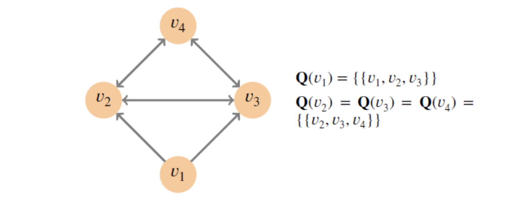

쿼럼은 합의에 도달하는데 충분한 노드 집합이다. 쿼럼 슬라이스는 쿼럼의 부분집합으로, 특정 노드에게 합의를 납득/설득 시킨다. 쿼럼 슬라이스는 쿼럼보다 작을 수 있다. 그림 2와 같이 노드가 네 개인 시스템을 검토해보자. 여기서, 각 노드에는 슬라이스가 한 개 있으며 화살표는 그 슬라이스의 다른 멤버를 가리킵니다. 노드 v1의 슬라이스 {v1, v2, v3}는 v1 에게 (어떤) 의견을 설득시키기에 충분 할것이다. 그러나 v2 및 v3의 슬라이스에는 v4가 포함된다. 즉, v4의 합의가 없다면 v2 또는 v3 중 어느 것도 (어떤) 의견을 주장하지 못한다는 뜻이다. 그러므로, v4가 참여하지 않는한 합의는 불가능하며, v1이 포함된 쿼럼은 모든 노드 {v1, v2, v3, v4}의 집합이 됩니다. 전통적인 비연합형 비잔틴 합의법에서는 모든 노드가 동일한 슬라이스를 승인해야 한다. 즉, ∀v1, v2, Q(v1)= Q(v2) 라고 표현 할 수 있다. 모든 멤버가 모든 슬라이스를 승인하므로, 전통적인 시스템에서는 슬라이스들과 쿼럼들을 구분하지 않는다.이때 불리한 것은 멤버십과 쿼럼들은 어떤 방식으로든 반드시 미리 결정되어야 한다는 것이다. 즉, 개방된 멤버십 및 탈중앙적 통제 방식을 배제한다는 뜻이다. PBFT 등과 같은 전통적인 시스템의 경우 [Castro and Liskov 1999], 
일반적으로 3ƒ + 1 개 노드를 지니게 된다. 이때, 임의 2ƒ + 1 개가 (하나의) 쿼럼을 구성한다. 여기에서 ƒ는 시스템이 살아남을 수 있는 비잔틴 장애의, 즉 노드가 임의대로 행동하는, 최대값이다.

본 논문에서 설명하는 FBA는 비잔틴 합의를 일반화하여 더 광범위한 환경에 적용시킨다. FBA의 핵심 혁신은 각 노드 v가 자기 쿼럼 슬라이스 집합 Q(v)를 선택할 수 있다는 것이다. 따라서, 각 노드가 개별적으로 내린 결정으로부터 시스템 전체 크기의 쿼럼이 등장한다. 노드는 평판이나 재정적 능력 등과 같은 임의의 기준을 기반으로 하여 슬라이스를 선택할 수 있다. 일부 환경에서는 그 시스템에 있는 모든 노드를 완벽하게 파악하는 개별 노드가 전혀 없더라도, 합의는 여전히 가능하다.

### 3.2 사례와 논의

그림 3은 계층형 시스템(tiered system)의 사례를 제시한다. 이 시스템에서 개별 노드는 각자의 슬라이스 집합을 지니는데, 이는 FBA에서만 가능하다. 상위 계층의 경우, v1, ... , v4로 구성되고, ƒ = 1 조건의 PBFT 시스템과 유사한 구조를 지닙니다. 
즉, 다른 세 개 노드들이 동기화 돼있고 선의로 행동하는 이상 비잔틴 장애 한 개를 허용할 수 있다는 의미다. 노드 v5,...,v8은 중간 계층을 구성하며, 상호간 의존성은 없으나, 상위 계층에는 의존적이다. 
중간 계층 노드를 위해 슬라이스를 형성하기 위해선 상위 계층 노드 두 개만 있으면 된다.(상위 계층은 최대 한 개의 비잔틴 장애를 가정한다. 따라서, 전체 시스템이 장애가 아닌 한 두개의 상위계층 노드가 모두 장애 일 수는 없다.)
노드 v9 및 v10 은 리프계층에 속하며, 슬라이스 한 개는 임의 두 개의 중간 계층 노드로 구성된다. v9 및 v10은 {v5, v6} 및 {v7, v8} 같은 관련없는 슬라이스들을 선택할 수 도 있다는 점에 유의해야한다. 그럼에도 불구하고, 이들 두 개는 간접적으로 상위 계층에 의존적이다. 

실제로, 상위 계층은 4개부터 12개에 이르는 유명하고 신뢰할 수 있는 금융기관들로 구성될 수 있다. 상위 계층의 크기가 커지면서 해당 멤버십에 대해 정확한 합의는 없을 수 있으나, 대부분의 참여자들의 상위 계층에 대한 개념은 상당히 일치할/공통 부분이 있을 것이다. 
이에 더하여 예를 들어, 각 국가나 또는 지리적 영역 당 한 개등, 여러 개의 중간 계층을 구상할 수도 있다.

이러한 계층형 구조는 도메인 간 네트워크 라우팅(inter-domain network routing)과 유사하다. 오늘날의 인터넷은 개별 피어링과 네트워크간에 트랜짓 관계에 의해 결합된다. 이런 배열을 명령하거나 중재하는 중앙 기관은 존재하지 않는다. 
그럼에도, 이와 같은 쌍 형태 관계는 실제적인 단일 계층 ISP 개념을 만들어내기에 충분하다 [Norton 2010]. 방화벽이 인터넷의 도달성을 제한하고 있지만, 전달로 우회하는/이행하는 도달성은 거의 완벽하다. 
예를 들어, 방화벽이 뉴욕 타임즈를 차단할 수 있다. 그러나 구글은 허용하면, 구글을 통해 뉴욕 타임즈에 도달 가능하고, 결국 뉴욕 타임즈는 우회해서 도달 가능하다. 
전달/이행을 통한 도달성을 웹 사이트에겐 제한적인 기능일 수 있지만. 합의에 있어서는 매우 중요하다. 이에 상응하는 사례로는 뉴욕 타임즈의 승인이 있는 경우에만 구글이 의견을 승인하는 것이다.

만일, 쿼럼 슬라이스가 네트워크 도달 가능성과 유사하고 쿼럼은 전달을 통한/이행 도달 가능성과 유사하다고 생각한다면, 인터넷이 지닌 완벽한 수준의 전달을 통한/이행 도달 가능성은 FBA를 통한 전세계적인 합의 역시 보장한다고 제시한다. 
여러면에서, 도메인 간 경로 구성과 비교할 때 합의는 비교적 쉬운 문제다. 트랜짓은 자원을 소비하고 비용이 필요하지만, 슬라이스 통합 방법은 그저 디지털 서명만 검사하면 된다. 
그러므로, FBA 노드는 포괄적인 측면에서 오류를 범 할 수 있으므로, 일반적인 피어링과 트랜짓 계약에서 보는 것보다 상호의존성과 중복성이 더 큰 보수적인 슬라이스들을 구성한다. 

중앙집중식 합의 방법에서는 불가능한 다른 사례로는 그림 4에서 설명한 순환 의존 구조가 있다. 
이런 순환은 의도적으로 발생하기 어렵지만, 개별 노드가 자기 슬라이스를 선택하면 궁극적으로 전체 시스템이 종속 사이클을 포함할 가능성도 있다. 
보다 중요한 사항으로, 전통적인 비잔틴 합의와 비교할 때, FBA 프로토콜은 훨씬 더 다양한 종류의 쿼럼 구조에 대처해야 한다는 점이다. 

### 3.3 안전성과 활동성 

노드는 선의로 행동하는 쪽과 악의로 행동하는 쪽으로 분류합니다. 선의로 행동하는 노드는 적합/합리적인한 쿼럼 슬라이스를 선택하며 (상세한 논의는 섹션 4.1 참조), 프로토콜을 따릅니다.
최종적으로 모든 요청에도 응답합니다. 악의로 행동하는 노드는 이와 다릅니다. 악의로 행동하는 노드는 비잔틴 장애 문제를 유발하고.

멋대로 행동합니다. 예를 들어, 악의적으로 행동하는 노드는 훼손되거나. 노드의 소유권자가 소프트웨어를 악의적으로 개조, 또는 노드가 충돌 상태 일 수 있습니다.

비잔틴 합의의 목적은 악의로 행동하는 노드가 존재하더라도 선의로 행동하는 노드가 동일한 값을 표면화하는 것을 보장하는 것입니다. 이 목표에는 두가지 목적이 있습니다. 
첫째로 ,노드가 동일 슬롯에 대해 상이한 값을 표면화하고 나뉘는 것을 방지하려 합니다. 
두 번째, 노드가 실제로 값을 확실하게 표면화할 수 있도록 보장하려 한다. 더 이상 합의가 불가능한 꽉 막힌 상태로 인한 차단은 발생하지 않아야 한다. 이와 같은 특징을 위해 다음과 같은 두 가지 용어를 소개하겠습니다

안전성 (정의)- 노드 두개 중 어느 쪽에서도 동일한 슬롯에 대해 상이한 값을 외부화하지 않는다면 FBAS의 하나의 노드 집합은 안전성을 누릴 수 있다.

활동성 (정의). 장애가 있는 (악의적인 행동 포함) 노드들의 참여를 배제한 상태에서 새로운 값을 외부화할 수 있다면 FBAS의 그 노드는 활동성을 누릴 수 있다.

안전성과 활동성 두 개를 모두 누리며 선의로 행동하는 노드를 적절하다고 부르겠습니다. 올바르지 않은 노드는 장애가 있습니다. 모든 악의로 행동하는 노드는 장애가 있으나 선의로 행동하는 노드도 장애가 있을 수 있습니다. 
이는 악의로 행동하는 노드로부터 메시지를 끝없이 기다린 것이 원인이거나, 더 나쁜 사례로는, 악의로 행동하는 노드의 잘못된 메시지가 상태에 나쁜영향을 미친 것입니다. 

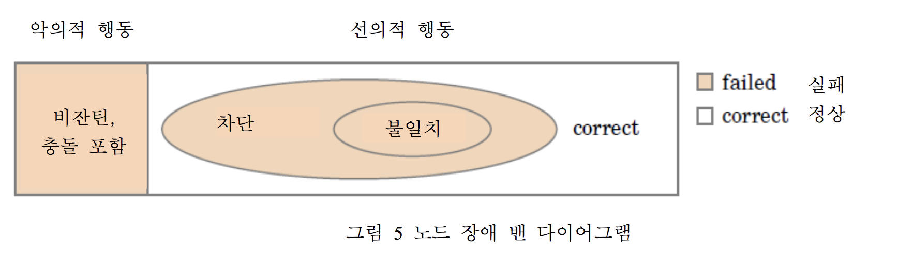

그림 5는 노드 장애의 여러 유형을 보여줍니다. 왼쪽이 비잔틴 장애이며, 이는 악의로 행동하는 노드를 뜻합니다. 오른쪽은 선의로 행동하지만 장애를 지닌 노드의 두 가지 유형입니다. 
활동성이 결여된 노드에는 차단이라는 용어를 사용했으며, 안전성이 결여된 노드에는 불일치(분기하는divergent)라는 용어를 사용했습니다. 안전성을 위반하는 공격이 활동성만 위반하는 공격보다 한층 더 위험합니다. 따라서, 불일치 한 노드를 차단의 부분집합으로 구분합니다.

노드가 새로운 값을 반드시 외부화하는 것이 아니라 그럴 가능성이 있다고 말하므로 활동성에 대한 정의는 설득력이 약합니다. 그러므로, 이 정의는 합의가 영원히 가능한 영구적인 선취권을 허용합니다. 
다만 네트워크는 중요 메시지를 지연하거나 재 요청해서 (합의를 )지속적으로 방해합니다. 순수 비동기, 결정론적 시스템에서는 노드 장애를 이겨내기 위해 영구적인 선점이 불가피합니다 [Fischer et al. 1985]. 
다행하게도, 선점 현상은 일시적입니다. 이 경우에 시스템은 언제라도 복구될 수 있으므로 노드 장애를 의미하지는 않습니다. 
프로토콜들은 무작위성을 이용하거나 [Ben-Or 1983; Bracha and Toueg 1985]. 메시지 지연과 관련된 실제적인 가정을 이용하여 [Dwork et al. 1988] 문제를 완화시킬 수 있습니다. 
실행 시간을 제한하고자 한다거나 또는 좀 더 효율적인 무작위적 알고리즘에서 요구되는 신뢰성있는 딜러를 회피하고자 한다면 지연 가정이 보다 실용적입니다. [?]. 물론, 메시지 타이밍에 의존하는 것은 안정성이 아닌 종료/종단뿐입니다.

## 4. 최적 복구

노드가 안전성과 활동성을 가질지 아닐지의 여부는 몇 가지 요소에 달려 있습니다. 즉, 선택한 쿼럼 슬라이스는 무엇인가, 어떤 노드가 악의로 행동하는가 구체적인 합의 프로토콜과 네트워크 환경 무엇인가 입니다. 
비동기 시스템에서와 흔히 볼 수 있는 것처럼. 최종적으로, 네트워크는 선의로 행동하는 노드 사이에서 메시지를 전달하나, 메시지를 멋대로 지연하거나 재배열할 수도 있다고 가정합니다..

본 섹션은 다음의 질문에 답변을 제시합니다;. 고유한 ⟨V, Q⟩ 및 악의로 행동하는 V의 특정 부분집합이 주어졌을 때, 네트워크와 상관없이 연합형 비잔틴 합의 프로토콜이 보장할 수 있는 최선의 안전성과 활동성은 무엇입니까?
우선, 안전성을 보장하려면 반드시 필요한 특성인 쿼럼 교차에 대해서 설명할 것입니다. 그런 다음 안전성과 생존 성을 모두 보장 할 수있는 실패한 노드의 불필요한 세트 ( dispensable sets) 개념을 도입합니다. 

### 4.1 쿼럼 교차

함수 Q로 표현되는 쿼럼 슬라이스가 쿼럼 교차라고 하는 유효성 특성을 충족한 경우에만 프로토콜이 합의를 보장합니다.

쿼럼 교차( quorum intersection) 정의 -. 쿼럼들 중 그 어떤 두 개의 쿼럼들이 노드 하나를 공유하는 필요충분조건이 충족되면 FBAS에 쿼럼 교차가 가능합니다. 즉, 모든 쿼럼 U1 및 U2에서, U1 ∩ U2 ≠ ∅ 입니다. 

그림 6은 쿼럼 교차가 결여된 시스템을 보여줍니다. 이 경우 Q는 교차하지 않는 쿼럼 두 개 {v1, v2, v3} 및 {v4, v5, v6}를 허용합니다. 
관련성 없는 쿼럼은 모순되는 의견에 별도로 합의할 수 있으므로, 시스템 전체의 합의를 손상시킵니다. 수많은 쿼럼이 있을 때, 두 개가 교차하지 않는다면 쿼럼 교차는 불가능합니다. 
예를 들어, 그림 6의 모든 노드 집합 {v1,...,v6}이 다른 두개와 교차하는 한 개의 쿼럼이지만, 시스템 차원에서는 쿼럼 교차가 여전히 결여되어 있습니다. 이는 그 두 개의 쿼럼이 상호간 교차하지 않기 때문입니다. 

쿼럼 교차가 없다면 어떤 프로토콜도 안전성을 보장하지 못합니다. 이는 이러한 구성은 어떤 메시지도 교환하지 않는 두 개의 상이한 FBAS 시스템으로서 작동할 수 있기 때문입니다. 
그러나, 쿼럼 교차가 있더라도 악의로 행동하는 노드가 존재한다면 안전성 보장은 불가능할 수 있습니다. 관련성 없는 쿼럼 두 개가 있는 그림 6과 단일 노드 v7에서 두 개의 쿼럼이 교차하고 v7은 악의로 행동하는 노드인 그림 7을 비교하겠습니다. 
만일 v7이 왼쪽과 오른쪽 쿼럼에게 일관성 없는 의견을 보낸다면, 그 결과는 관련성 없는 쿼럼의 것과 동일합니다.

사실상, 악의로 행동하는 노드는 안전성에 대해서 아무런 역할도 하지 않으므로, 스스로 쿼럼 교차가 가능한 선의로 행동하는 노드가 그 안에 없다면 어떠한 프로토콜도 안전성을 보장하지 못합니다. 
결국, 안전성에 대한 최악의 시나리오라면, 악의로 행동하는 노드는 언제나 쿼럼을 종료시키는 (모순되는) 구문/의견만 만들수 있습니다. 
마찬가지로, 악의로 행동하는 노드에서만 중첩되는 쿼럼 두 개는 악의로 행동하는 노드의 이중성으로 인하여 두 개의 다른 FBAS 시스템과 같이 작동할 가능성이 있습니다.

즉, FBAS ⟨V, Q⟩는 필요충분조건으로 V에서와 Q의 모든 슬라이스에서 B의 노드를 삭제한후 ⟨V, Q⟩가 쿼럼 교차를 누릴 때만 한 개 노드 집합 B ⊆ V으로 비잔틴 장애를 버틸 수 있습니다. 정식 표현은 다음과 같습니다:

삭제(Delete ) 정의 :. 만일 ⟨V, Q⟩가 FBAS이며 B ⊆ V가 한 개 노드 집합이라면 ⟨V, Q )B로 표현하는 ⟨V, Q⟩에서 B 삭제는 수정된 FBAS⟨V⧵B,QB⟩의 계산을 의미합니다. 이때,QB(v)={q⧵B∣q ∈ Q(v)}입니다.

Q(v)의 쿼럼 교차 위반 여부를 확인하는 것은 각 노드 v의 책임 사항입니다. 이렇게 하는 방법 중 한 가지는 큰 쿼럼으로 이어지는 보수적인 슬라이스(Slice )를 선택하는 것입니다. 
물론, 악의적인 v가 의도적으로 Q(v)를 선택하여 쿼럼 교차를 위반할 수 있으나, 악의적인 v는 Q(v) 값에 대해서 거짓을 말할 수도 있으며, 독단적인 주장을 하기위해 Q(v)를 무시할 수도 있습니다. 
즉, v가 악의로 행동하는 경우 Q(v) 값은 무의미합니다. 안전성의 필수 특성인 악의로 행동하는 노드를 삭제한 후 선의로 행동하는 노드의 쿼럼 교차가 악의로 행동하는 노드의 슬라이스로부터 영향을 받지 않는 이유가 바로 이것입니다.

그림 6이 쿼럼 교차가 있는 3개 노드 FBAS v1, v2, v3에서 쿼럼 교차없는 6개 노드 FBAS로 바뀐것으로 가정합니다. v4, v5, v6는 결합 시, 쿼럼 교차를 위반하는 슬라이스를 악의적으로 선택하며, 어떠한 프로토콜도 V에 대해 안전성을 보장하지 못합니다. 
다행히도, <V, Q>{v4,v5,v6}을 산출하기 위해 악성 노드를 삭제함으로 쿼럼 교차를 복원합니다. 즉, 최소 {v1, v2, v3}에서 안전성이 가능할 수 있다는 의미입니다. 최적의 안전성을 기술하기 위해서 삭제는 개념적이라는 점에 유의하십시오. 
프로토콜은 v4, v5, v6이 악의로 행동한다는 것을 파악하지 않아도 v1, v2, v3에 대해서 안전성을 보장해야만 합니다. 

### 4.2 불필요 집합 (Dispensable Set , DSet) 

불필요 집합 또는 DSet라는 개념을 통해서 노드의 슬라이스 선택에서 장애 허용을 파악하겠습니다. 약식으론 DSet 외부에 있는 노드들의 안전성과 활동성은 DSet 내부에 있는 노드들의 행동과 무관하게 보장될 수 있습니다. 
달리 표현하자면 최적의 회복력을 지닌 FBAS의 경우, 단일 DSet가 악의로 행동하는 노드를 모두 포함하고 있다면, 장애가 있는 모든 노드 역시 포함되어있습니다. 반대로, DSet 외부에 있는 모든 노드는 적절합니다. 
한 가지 사례로서, 3ƒ + 1 개 노드와 쿼럼 크기 2ƒ + 1 개를 지닌 중앙집중식 PBFT 시스템에서는 임의 ƒ 또는 그 이하의 노드가 DSet를 구성합니다. 사실상 PBFT는 최대 ƒ 개의 비잔틴 장애로 부터까지 살아남기 때문에 그 견고성은 최적화되어 있습니다.

좀 더 일반적이지 않은 그림 3 사례의 경우, {v1}은 DSet입니다. 왜냐하면, 상위 계층 노드 한 개가 나머지 시스템에 영향을 미치지 않고 장애/오류가 발생할 수 있기 때문이다. {v9} 역시 DSet입니다. 왜냐하면, 다른 어떤 노드도 v9에 정확성을 의존하지 않기 때문입니다.

{v6, ... , v10}은 DSet입니다. 왜냐하면, v5 또는 상위 계층 중 어느쪽도 이들 5개 노드에 의존하지 않기 때문입니다. {v5, v6}은 DSet이 아닙니다. 왜냐하면, v9 및 v10을 위한 슬라이스이기 때문이며, 따라서, 만일 완전히 악의적이라면, v9 및 v10에게 거짓을 말하여 서로 또는 나머지 시스템과 모순되는 주장들을 설득시킬 수 있기 때문입니다.

악의로 행동하는 DSet가 다른 노드의 정확성에 영향을 미치지 못하게 하려면, 두 가지 특성이 반드시 성립되어야 합니다. 
안전성의 측면에선, DSet를 삭제하는 것은 쿼럼 교차를 약화시키지 못합니다. 활동성의 측면에선, DSet은 다른 노드에서 작동 중인 쿼럼을 부인하지 못합니다. 이를 통하여 다음의 정의가 도출됩니다:

DispensableSet,Dset 정의 :.<V,Q>는 FBAS이며 B ⊆ V는 한 개 노드 집합으로 가정합니다.B를 불필요 집합, 또는 DSet이라고 합니다. 그 필요충분조건은 다음과 같습니다:

(1)  (B에도 불구하고 쿼럼 교차) <V, Q> B는 쿼럼 교차가 가능합니다. 그리고,

(2)  (B에도 불구하고 쿼럼 가용성)⟨V,Q⟩에서 V⧵B는 쿼럼이거나, 또는 B=V. 이 둘 중 하나입니다.

B에도 불구하고 쿼럼 가용성 (Quorum Availabiliity ) 은 B에 있는 요청의 회신을 거부하고 다른 노드의 진행을 차단하는 노드들로부터 보호합니다. B에도 불구하고 쿼럼 교차(Quorum intersection )는 B에 있는 그 반대되는 노드들로부터 보호됩니다. 즉, 다른 노드들이 동일 슬롯에 대해서 일관성이 없는 값들을 외부화할 수 있게 모순되는 주장을 하는 노드들로부터. 노드는 슬라이스 선택에서 이 두 개 위협으로부터 반드시 균형을 잡아야 합니다. 다른 모든 조건이 동일할때, 더 큰 슬라이스는 더 큰 중첩을 지닌 더 큰 쿼럼으로 이어집니다. 즉, 더 적은 수의 장애가 있는 노드 집합들 B가 삭제 시 쿼럼 교차를 약화시킨다는 의미입니다. 반면, 더 큰 슬라이스에는 장애 노드가 있을 가능성이 높으므로 쿼럼 가용성에 위험을 초래합니다.

충분히 큰 악의로 행동하는 노드 집합이 선의로 행동하는 노드에서 장애가 발생하도록 만들 수 있다는 점을 생각하면 모든 악의로 행동하는 노드가 들어있는 가장 작은 DSet에도 선의로 행동하는 노드가 포함될 수도 있습니다. 예를 들어, 그림 3의 경우, v5 및 v6이 들어있는 가장 작은 DSet는 {v5, v6, v9, v10}입니다. FBAS⟨V, Q⟩가 V에도 불구하고 무의미하게 쿼럼 교차를 허용할때, 또 특별한 경우로 V에도 불구하고 쿼럼 가용성을 허용할때, 모든 노드 집합 V는 항상 DSet입니다. 특별한 경우일때 동기는 다음과 같습니다. 충분하게 많은 악의적인 노드가 주어진 경우, V는 모든 악의로 행동하는 노드가 든 가장 작은 DSet일 수 있습니다. 이것은 어떠한 프로토콜도 완전한 시스템 장애보다 너 나은 상태를 보장하지 못하는 시나리오를 의미합니다.

FBAS에 든 DSet는 쿼럼 함수 Q로 미리 결정됩니다. 어떤 노드가 선의로 행동하는지 그리고 악의로 행동하는지는 기계(머신)가 손상 되는 것과 같은 런타임 거동에 의해서 결정됩니다. 논의 중인 DSet은 악의로 행동하는 모든 노드를 포함한 것들입니다. 왜냐하면, 적정성이 반드시 보장이 되어야 하는 노드들과 그런 보장이 불가능한 노드들을 식별하는데 도움을 주기 때문입니다. 이렇게 하기 위해서 다음의 용어들을 설명하겠습니다:

온전한 (intact ) 정의:. 악의로 행동하는 모든 노드를 포함한 DSet B가 존재하고 이때 v ∉ B인 경우에만 FBAS의 노드 v는 무결합니다.

오염된 ( befouled ) 정의:. FBAS의 노드 v는 무결 상태가 아닐 경우에만 오염되어 있습니다. 

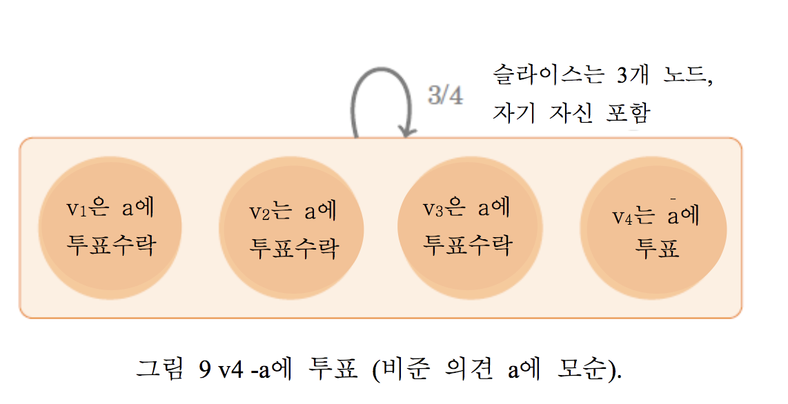 

오염 노드 v는 그 진행을 차단하거나, 또는 그 상태에 악영향을 주기 충분한 수의 장애 노드에 둘러싸여 있습니다. 이는 v 자체가 선의 행동인 경우에도 그렇습니다. 어떠한 FBAS도 오염 노드의 올바름을 보장할 수 없습니다. 
그러나, 최적의 FBAS는 모든 온전한 노드가 올바르게 유지된다고 보장합니다. 그림 8은 노드들의 핵심 특성을 요약합니다. 다음의 정리는 쿼럼 교차가 있는 FBAS에서 오염된 노드 집합은 항상 DSet라는 것을 증명하여 분석을 수월하게 합니다.

정리 1. U를 FBAS ⟨V, Q⟩의 쿼럼이라고 가정합니다. B ⊆ V는 하나의 노드 집합이라고 가정하며, U′ = U ⧵ B라고 가정합니다. 만일 U′ ≠ ∅이라면 U′는 ⟨V, Q⟩B의 쿼럼입니다.

증명. U는 쿼럼이므로, 모든 노드 v ∈ U는 q ∈ Q(v)가 있고 이때 q ⊆ U 입니다. U′ ⊆ U이므로 모든 v ∈ U′는 q ∈ Q(v)가 있고 이때 q ⧵B ⊆ U′입니다. 삭제 후 표기법을 재작성하면 ∀v ∈ U′, ∃q ∈ QB(v)가 도출됩니다. 
이때 q ⊆ U′이며, 이것은, U′ ⊆ V ⧵ B이기 때문에 ⟨V, Q⟩B에서 U′가 쿼럼이라는 것을 의미합니다.

정리 2. 만일 쿼럼 교차가 가능한 FBAS<V,Q>에서 B1 및 B2가 DSets이면,B=B1∩B2는 마찬가지로 DSet입니다.

증명.U1 =V⧵B1 그리고 U2 =V⧵B2를 가정하게 된다면. U1 =∅일떼,B1 =V이며 B=B2 (DSet)입니다. 따라서, 증명이 완료됩니다. 이와 비슷하게, 만일 U2 = ∅이면, B = B1이며, 증명이 완료됩니다. 
그렇지 않다면, DSetB1 및 B2에도 불구하고 쿼럼 가용성에 따라 U1 및 U2는 ⟨V,Q⟩의 쿼럼입니다. 이는 두 개 쿼럼의 합집합 역시 하나의 쿼럼이라는 정의를 따르기 때문입다. 따라서,V⧵B=U1 ∪ U2는 쿼럼이며 B에도 불구하고 쿼럼 가용성을 보유합니다.

이제 B에도 불구하고 쿼럼교차를 증명해야 합니다.Ua 및Ub를 <V,Q>B의 두개의 임의의 쿼럼으로 가정합니다. U=U1∩U2=U2╲B1을가정합니다. ⟨V,Q⟩의 쿼럼교차 에 의해, U=U1∩U2≠∅입니다. 
그러나 이때, 정리 1에 의거해 U=U2⧵B1는 반드시 <𝑉,𝑄>𝐵1의 쿼럼이어야 합니다. 이제 Ua⧵B1 및 Ua⧵B2 이 둘이 모두 공집합이 될 수 없거나.Ua ⧵B=Ua가 됨을 증명합니다. 
따라서, 정리 1에 따라,Ua ⧵B1이 (<V,Q>B)B1 =<V, Q> B1의 쿼럼이거나, Ua ⧵B2이 (< V, Q >B)B2 = <V, Q> B2의 쿼럼이거나, 또는 둘다 일것입니다.

앞선 사례의 경우, 만일 Ua ⧵B1이 ⟨V,Q⟩B의 쿼럼인 경우,⟨V,Q⟩B1의 쿼럼 교차에 의해서,(Ua ⧵B1)∩U≠∅임에 유의해야 합니다. 
왜냐하면,(Ua ⧵B1)∩U=(Ua⧵B1)⧵B2이므로, 결과적으로 Ua ⧵B2 ≠∅이며, 이에 따라 Ua ⧵B2는 <V, Q> B2의 쿼럼입니다. 유사한 논거에 따라, Ub ⧵ B2는 반드시 <V, Q> B2의 쿼럼이어야 합니다. 
그러나 이때, B2에도 불구하고 쿼럼 교차는 (Ua ⧵B2)∩(Ub ⧵B2)≠∅이라고 말하는데 이는 Ua ∩Ub ≠∅인 경우에만 가능합니다.

정리 3. 쿼럼 교차가 있는 FBAS에서, 오염 노드의 집합은 DSet입니다.

증명. Bmin을 악의로 행동하는 모든 노드를 포함하는 모든 DSet의 교차라고 가정합니다. 필요충분조건 v ∉ Bmin를 충족 시 노드 v는 온전하다라는 것은 온전한( intact) 정의로부터 도출됩니다. 
따라서, Bmin은 정확하게 오염 노드의 집합입니다. 정리 2에 의거하여, DSet은 교차 (조건)하에선 닫혀있습니다. 

따라서 Bmin 역시 DSet입니다.

## 5. Federated Voting 

본 섹션에서는 FBAS 노드가 의견에 대한 합의 시 사용할 수 있는 연합 투표 방법에 대해 설명한다. 높은 레벨에서, 어떤 의견 a에 대한 합의 과정에는 노드들이 두 세트의 메시지를 교환하는 과정이 포함된다. 
우선, 노드들은 a에 투표한다. 그리고 투표가 성공적인 경우, 노드들은 a를 승인한다. 즉, 첫 투표가 성공적이었다는 사실에 관한 두 번째 투표를 한다.

각 노드의 입장에서 보면, 두 차례의 메시지는 의견 a에 대한 합의를 미지(unknown), 수락(accept), 확정(confirm) 등의 세 개 단계로 나뉜다. (본 패턴은 3단계 커밋 시점까지 거슬러 올라간다 [Skeen and Stonebraker 1983].) 
처음엔, 노드 v에게 a 상태가 완전히 미지의 상태에 있다 –  a는 최종적으로 참, 거짓 또는 심지어 영구 불확정 상태에 빠질 수 있다. 만일 최초의 투표가 성공적이라면, v는 a를 수락할 수도 있습니. 
그 어떤 두 개의 온전한 노드도 서로 모순되는 의견을 수락하지 않습니다. 따라서, 만일 v가 온전하며 a를 수락하면, a는 거짓일 수가 없다.

그러나, 두 가지 이유로 인하여, v가 a를 수락하는 것이 v가 a에 따라 행동하기엔 충분하지 않다. 우선, v가 a를 수락 했다고 해서 모든 온전한 노드가 그럴 수 있다는 의미는 아니다. a가 다른 노드들에서는 고착 될 수 있기 때문이다. 

두 번째, 만일 v가 오염됐다면, a에 대한 수락은 무의미하다 - a가 온전한 노드에서는 거짓 상태일 수 있다. 그러나, v가 오염됐더라도 - v 자신은 모르지만 - 시스템은 여전히 선의로 행동하는 노드의 쿼럼 교차를 허용할 수 있으며, 이 경우, 최적 안전성을 위해서는, v는 a에 대한 더 큰 확신이 필요하다. 
a에 대한 두 번째 투표진행은 이 두 가지 문제에 대처한다. 만일 두 번째 투표가 성공적이라면, v는 확정 단계로 진행하며, 이 경우 결국 a를 참으로 간주하고 처리할 수 있다.

아래의 하부 섹션에서는 연합 투표 과정을 상세하게 논의한다. 투표는 의견 고착 가능성을 배제하지 않으므로, 섹션 5.6에서는 이에 대한 대처법을 설명할 것이다. 섹션 6은 연합 투표를 노드에서 슬롯의 고착 가능성을 피하는 합의 프로토콜로 만들어지는 과정을 설명한다.

### 5.1 오픈 멤버십에서의 투표 

비잔틴 합의 시스템에서의 올바른 노드는 다른 올바른 노드들이 a에 모순되는 의견에 절대로 합의를 하지 않을 거라는걸 아는 경우에만 의견 a를 처리한다. 대부분의 프로토콜은 이런 목적을 위해서 투표를 채택한다.
선의로 행동하는 노드는 의견 a가 유효한 경우에만 a에 투표한다. 선의로 행동하는 노드는 절대로 자신의 표를 변경하지 않는다. 
따라서, 중앙집중식 비잔틴 합의의 경우, 만일 선의로 행동하는 노드 대다수가 포함된 쿼럼이 찬성 투표를 했다면 a를 수락하는 편이 안전하다. 한 의견이 필요한 투표수를 한 번 받으면 비준됐다고 표현한다. 

연합형 환경의 경우, 오픈 멤버십를 수용하기 위해 반드시 투표를 채택해야 한다. 한 가지 차이점은 쿼럼이 선의로 행동하는 노드 대다수에 더 이상 부합하지 않다는 점이다.

개방된 멤버십에 함축되있는 또 하나는 노드가 (투표 과정의 일부로서) 쿼럼의 구성 내용을 반드시 알아내야 한다는 점이다. 쿼럼 검색을 구현하려면 v에서 오는 모든 메시지에 대해서 프로토콜이 Q(v)를 지정해야 한다.

투표(Vote) 정의 . 노드 v는 (추상적인) 의견 a에 대해 투표한다. 이때, 필요충분조건은 다음과 같다.

v는 a가 유효하며 v가 수락한 모든 의견들과 일관성이 있다는 것을 단언한다. 그리고

v는 a에 반대투표, 즉 a와 모순되는 의견, 에 투표한적이 없다고 단언한다. 또한, v는 향후 a에 반대투표하지 않을 것을 약속한다. 

비준 (Ratify ) 정의 : Ua의 모든 멤버가 a에게 투표해야만 쿼럼 Ua는 의견 a를 '비준한다'고 표현한다. v가 a를 비준하는 쿼럼 Ua의 멤버 중 하나여야만 노드 v는 a를 비준한다.

정리 4. 쿼럼 교차를 허용하며 악의로 행동하는 노드를 포함하고 있지 않은 FBAS에서 두 개의 모순되는 의견 a와 a̅ 가 모두 비준되지는 못한다.

증명. 모순에 의거해서. 쿼럼 U1이 a를 비준하고 쿼럼 U2가 를 비준하는 것으로 가정한다. 쿼럼교차에 의해서,∃v∈U1∩U2 .이러한 v의 경우 반드시 a와 a̅ 둘다에게 위법 투표했으며 이는 악의로 행동하는 노드는 없다는 가정을 위반한다.

정리 5. ⟨V, Q⟩를 B에도 불구하고 쿼럼 교차를 가능하게 하는 FBAS라고 가정하고, B에 악의로 행동하는 모든 노드가 포함되어 있다고 가정한다. v1 및 v2를 B에 없는 두 개 노드로 가정한다. a 및 a̅ 를 모순되는 의견이라 가정한다. 만일 v1이 a를 비준하면 v2는 를 a̅ 를 비준하지 못한다.

증명. 모순에 의거헤서. v1은 a를 비준하고 v2는 a̅ 를 비준한다고 가정하자.
정의에 따라, a를 비준한 v1을 지닌 쿼럼 U1이 존재해야 하며, a̅ 를 비준한 v2를 지닌 쿼럼 U2가 존재해야 한다. 정리 1에 의거하여,U1⧵B≠∅이고 U2 ⧵B≠∅이므로, 이들 둘다 반드시 <V,Q> B의 쿼럼이어야 한다. 
즉, <V, Q> B에서 a 및 를 각각 비준해야 한다는 의미다. 그러나 <V, Q>B는 쿼럼 교차를 허용하며 악의로 행동하는 노드는 가지지 않으므로정리 4는 a 및 가 모두 비준되지는 못한다는 점을 말해준다.

정리 6. 쿼럼 교차를 지닌 FBAS에 있는 두 개의 온전한 노드는 모순되는 의견을 비준하지 못한다.

증명. B를 오염된 노드 집합으로 가정합니다. 정리 3에 의거해서, B는 DSet이다.
DSet 정의에 따르면, ⟨V, Q⟩는 B에도 불구하고 쿼럼 교차를 허용한다 . 정리 5에 따라, B에 없는 두 개 노드는 모순되는 의견을 비준하지 못한다. 

### 5.2 차단 집합 (Blocking set ) 

중앙집중식 합의 일때, liveness는 양자택일적(all-or-nothing) 시스템 특성을 지닌다. 만장일치로 선의의 행동을 하는 쿼럼이 존재하거나, 또는 악의적인 노드가 시스템의 나머지 부분에서 새로운 의견을 수락하지 못하도록 할 수 있다. 
이와 달리 FBA에서는 노드마다 liveness가 다를 수 있다. 예를 들어, 계층형 쿼럼 사례인 그림 3의 경우, 만일 중간 계층 노드 v6, v7, v8이 충돌하는 경우, 리프 계층은 차단되지만, 상위 계층과 노드 v5는 계속해서 liveness를 허용합니다.

FBA 프로토콜은 Q(v)가 올바른 노드로만 구성된 쿼럼 슬라이스를 최소 한 개 포함한 경우에만 노드 v에 대해 liveness를 보장할 수 있다. B에 v의 슬라이스 각각의 멤버가 최소 하나씩 포함된 경우, 장애 노드의 집합 B는 본 특성을 위반할 수 있다. 
이런 집합 B를 V-Blocking 이라고 명명한다. 왜냐하면, v의 진행을 차단할 능력이 있기 때문이다.

v-blocking 정의 : v ∈ V를 FBAS ⟨V, Q⟩의 노드라고 가정하자. 집합 B ⊆ V는 v의 슬라이스 각각과 모두 일치(중복)해야만 v-blocking 이다. 즉, ∀q ∈ Q(v),q∩B≠∅.

정리 7. B ⊆ V를 FBAS ⟨V, Q⟩의 노드 집합 한 개로 가정하자. 임의 v ∈ V ⧵ B에 대해서 B는 v-차단(v-blocking) 이 아닐 경우에만 ⟨V, Q⟩는 B에도 불구하고 쿼럼 가용성을 허용한다. 

증명.“∀v ∈ V⧵B,B는 v-blocking이 아니다”는 “∀v ∈ V⧵B, ∃q ∈ Q(v)입니다,이때 q ⊆ V⧵B이다”와 동일하다. 쿼럼 정의에 따라서, 후자는 V⧵B는 쿼럼이거나 또는 B = V일 경우에만 성립한다. B에도 불구하고 이것이 쿼럼 가용성의 정확한 정의다.

그 결과, 그 어떤 임의의 온전한 v에 대해서도 오염된 노드의 DSet는 v-blocking이 아닙니다. 

### 5.3 의견 수락

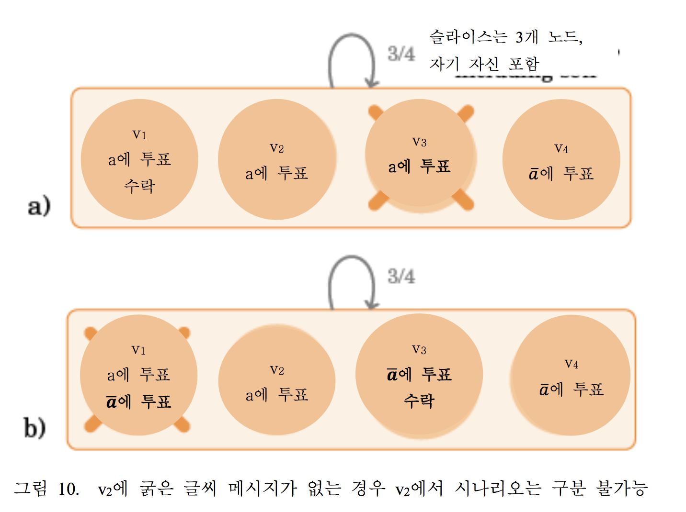

온전한 노드 v가 한 의견을 비준했다고 파악한 경우, 정리 6에 따라 v는 다른 온전한 노드들이 모순되는 의견들을 비준하지 않을 것이라고 알 수 있다. 본 경우는 v가 a를 승인하기에 충분하지만, 필수라고는 할 수 없다. 
의견을 비준하려면 투표가 꼭 필요하며, 일부 노드는 모순되는 의견에 이미 투표했을 수도 있다. 예를 들어 그림 9에서, v4는 다른 세 개 노드가 모순되는 의견 a를 비준했다는 것을 파악하기 전에 a̅ 에 투표할 경우. 
비록 v4가 이제 a에 투표하지는 못하지만, 다른 노드들과 일관될 수 있게 a를 수락할 것을 여전히 바라고 있다.

중요한 사항은, 만일 노드 v가 온전하다면 그 어떠한 v-차단(v-blocking) 집합 B도 오염된 노드만으로 구성되지는 못한다는 점이다. 이제 B를 v-blocking 집합이라 가정하고 B의 모든 멤버가 의견 a 수락을 주장한다고 가정하자. 만일 v가 온전하다면, B의 멤버중 최소 하나도 반드시 그러해야 한다. 무결 멤버는 a 수락에 대해서 거짓을 말하지 않는다. 따라서, a는 참이며 v는 수락할 수 있다. 
물론, 만일 v가 오염된 경우라면, a는 참이 아닐 수도 있다. 그러나, 오염 노드는 그 어떤 것도 수락할 수 있으며, 무결 노드의 정확성에 영향을 미치지 않는다.

정의 (수락). FBAS 노드 v는 의견 a를 수락한다.
이에 필요충분조건은 a에 모순되는 구문을 아직 승인한 적이 없으며, 다음과 같이 판단한다:

(1)  쿼럼 U가 존재한다.
이때 v ∈ U이며 U의 각 멤버는 a에 투표를 했거나 또는 a를 수락한다고 주장합니다. 또는,

(2)  v-blocking 집합의 각 멤버는 a를 수락한다고 주장한다.

비록 선의로 행동하는 노드는 모순되는 의견에 투표하지 못하지만, 상기 조건 2는 노드가 한 의견에 투표하고 그 후 모순되는 의견을 수락하는 것을 허용한다.

정리 8. 쿼럼 교차를 허용하는 FBAS의 두 개의 온전한 노드는 모순되는 의견을 승인하지 못한다. 

증명. ⟨V, Q⟩를 쿼럼 교차가 있는 FBAS로 가정하고, B를 오염된 노드 DSet로 가정한다 (정리 3에 따라서 존재함 ). 온전한 노드가 의견 a를 수락한다고 가정한다.
v는 a를 수락하는 첫 번째 온전한 노드로 가정하자. v가 a를 수락할 때,B의 오염된 노드만 수락을 요구할 수 있다. 정리 7의 결과에 따라서, B는 v-blocking이될 수 없으므로, v가 조건 1에 따라 a를 수락 했어야만 한다. 
따라서, v는 쿼럼 U를 식별하며, 이때 모든 노드는 a에게 투표하거나 수락한다고 주장한다. 그리고 v가 a를 수락하는 첫 번째 온전한 노드이고 모든 노드가 a에 투표하거나 받아들이는 쿼럼 U를 식별하기때문에 , 이는 U ⧵B의 모든 노드가 a에 투표했다는 의미가 되어야 한다.

즉, v는 ⟨V, Q⟩B의/에서 a를 비준한다. 일반화 하자면, ⟨V, Q⟩의 온전한 노드가 수락한 의견은 ⟨V, Q⟩B에서 반드시 비준을 받아야 한다. B는 DSet이므로, ⟨V, Q⟩B 는 쿼럼 교차를 허용한다. 이에 더하여, B는 악의적인 모든 노드를 포함하므로, 정리 4는 모순되는 의견의 비준을 배제한다. 

### 5.4 수락으로는 충분하지 않다. 

불행하게도, 노드가 수락된 의견의 진위에 대해 추장하는 것은 연합형 합의 프로토콜에서 차선의 안전성과 liveness를 보장하는 결과를 만든다. 이번에는 안전성과 liveness에 대한 문제를 차례대로 기술 하도록 한다. 
설명을 보충하기 위해서, 중앙집중식 비잔틴 합의보다 FBA에서 본 문제가 더 곤란한 이유를 제시 할 것이다. 

#### 5.4.1 안전성

FBAS의 ⟨V, Q⟩를 검토해보자. 이때, 유일한 쿼럼은 만장일치 합의다. 즉, ∀v, Q(v) = {V}로 나타낸다.

이것은 안전성에 있어서 보수적인 선택이 되어야 한다. 즉, 모두가 합의하지 않는다면 아무 것도 하지 않아야 한다. 그러나 모든 노드가 모든 v에 대해서 v-blocking 이므로, 한 노드는 혼자 힘으로 다른 노드가 임의 의견들을 수락하도록 설득할 수 있다.

문제는 수락된 의견들이 온전한 노드사이에서만 유일하게 안전하다는 것입니다. 그러나, 섹션 4.1에 기술된 것과 같이, 안정성 보장에 필요한 유일한 조건은 선의로 행동하는 노드의 쿼럼 교차이며, 이는 일부 선의로 행동하는 노드가 오염된 경우에도 여전히 유지 될 수도 있습니다. 
특히, Q(v)= {V}인 경우, 유일한 DSet는 ∅와 V입니다. 이는, 그 어떤 노드 장애라도 전체 시스템을 오염시킨다는 의미입니다.
이와 달리, 모든 B ⊆ V에도 불구하고 쿼럼 교차는 유지됩니다. 

#### 5.4.2 활동성

수락된 의견의 다른 제한사항은 다른 무결 노드들이 수락을 하지 못할 수도 있다는 점입니다. 이런 가능성은 수락된 의견에 대한 의존도로 인해 활동성에게 문제가 되게 만듭니다. 
만일 노드가 의견을 수락했기 때문에 의견에 따라 처리를 계속하는 경우, 다른 노드들은 유사한 방식으로 진행하지 못할 수 있습니다. 

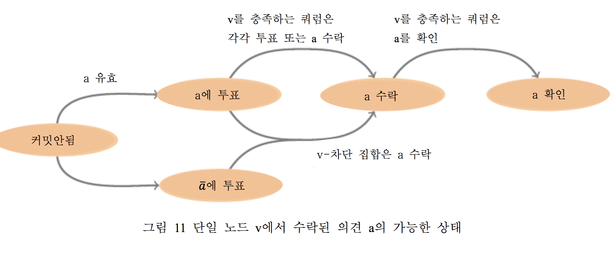

그림 10 a)를 볼 때, 노드 v3은 v1이 의견 a를 비준하고 수락하는 것을 도와준 후에 충돌합니다. 비록 v1은 a를 수락하지만, v2 및 v4는 그렇게 하지 못합니다. 특히, v2의 입장에서 보면, 이 상황은 그림 10 b)와 구분되지 않습니다. 
그림 10 b)의 경우, v3은 ̅에 투표하며 선의의 행동을 하지만 응답이 느립니다. 반면, v1은 악의적인 행동을 하며 v3에게 ̅ 에 대한 투표를 보내는(이로써 v3이 ̅ 를 수락하게 만든다) 동시에 역시 부당하게 v2에게 a에 대한 투표를 보냅니다.
그림 10 a)와 같은 사례에 있어서 활동성에 대한 프로토콜-레벨의 개념을 지원하기 위해서, v1는 v1가 a를 처리하기 전에 다른 모든 온전한 노드들이 결국 a를 수락할 수 있다는 것을 보장할 방법이 찾아야 합니다. 
일단 이것이 맞다면, 시스템이 a를 수락했다고 표현하는 것이 옳습니다.

동의 (Agree) 정의. FBAS에서 ⟨V, Q⟩는 후속 결과와 무관하게, 일단 충분한 메시지가 전달 및 처리된경우에, 모든 무결 노드는 a를 수락한다는 필요충분조건으로만 의견 a에 동의합니다. 

#### 5.4.3 중앙집중식 투표와 비교

합 투표에서 위의 문제가 발생하는 이유를 이해하기 위해서 쿼럼 크기 T를 지닌 N 노드의 중앙집중식 비잔틴합의 시스템을 검토합니다. 이런 시스템의 경우는 ƒL =N−T 또는 더 낮은 노드 장애를 가진 쿼럼 가용성을 허용합니다. 임의 두 개의 쿼럼이 최소 2T −N 개 노드를 공유하므로, 선의로 행동하는 노드의 쿼럼 교차는 최대 ƒS =2T−N−1 개의 비잔틴 장애를 유지합니다.

중앙집중식 비잔틴 합의 시스템은 일반적으로 N=3ƒ+1 및 T=2ƒ+1 설정으로 ƒL =ƒS =ƒ를 산출하며, 이것은 안전성과 활동성이 동일한 장애 허용을 지니는 평형점입니다. 
만일 안전성이 활동성보다 더 중요한 경우, 일부 프로토콜에서는 T를 증가시켜서 ƒS > ƒL로 됩니다 [Li and Mazie`res 2007]. FBA의 경우, 쿼럼이 유기적으로 발생하므로, 시스템이 평형 상태로 될 가능성이 낮습니다. 이는, 활동성이 없을 때에 안전성을 보호하는 일이 더욱 중요해집니다.

이제 중앙집중식 시스템을 검토하겠습니다. 이 경우, 노드 장애와 모순되는 투표가 있으므로, 일부 노드 v는 다른 노드들에서 비준된 의견 a를 비준하지 못합니다. 
만일 v가 ƒS +1 개 노드가 a가 비준되었다고 주장하는 것을 접하면, v는 이들 중 하나가 선의로 행동하는 것이거나 또는 모든 안전성 보장이 붕괴되었다는 것을 알게됩니다. 어느 쪽이건, v는 안전성에 대한 손실 없이 a에 대해 조치를 취할 수 있습니다. 
이와 동등한 FBA경우는 집합 B로부터 접하는 것입니다. 이때 B가 삭제된 경우 선의로 행동하는 노드의 쿼럼 교차를 손상시킵니다. 이런 B를 식별하는 것은 세 가지 이유 때문에 어려운 일입니다. 첫째, 쿼럼은 동적으로 발견됩니다. 
둘째, 악의적으로 행동하는 노드는 슬라이스에 대해 거짓말을 할 수 있습니다. 셋째, v는 어떤 노드가 선의의 행동을 하는지 알지 못합니다. 이와 달리/대신에, 본 논문에서는 연합 투표는 (v-차단 v-차단 특성에는 점검이 쉽다는 장점이 있습니다. 
그러나, 실제로는 ƒS +1 개를 원할 때 중앙집중식 시스템에서 ƒL +1 개 노드로부터 접하는 것과 동일합니다. 

중앙집중식 시스템에서 선의로 행동하는 모든 노드들간의 합의를 보장하려면, 그저 ƒL + ƒS + 1 개 노드들이 의견이 비준되었다고 인정하면 됩니다. 만일 이들 중 ƒL 개 이상에서 장애가 있으면, 어차피 활동성은 기대하지 못합니다.
만일ƒL 개또는그미만이장애라면,ƒS +1개 노드는 여전히 비준을 증명할 용의가 있다는 것을 압니다. 이는 결국 다른 모든 선의로 행동하는 노드들을 설득시킵니다. 
ƒS 개에 대한 의존성은 FBA 모델로는 쉽게 비교하지 못합니다. 그러나, 놀랍게도 유사한 접근법을 제안하는 ƒL +ƒS +1=T(쿼럼 크기)는 보다 복잡한 합리화와 같이 일/작동할수도 있습니다.

달리 표현하면 다음과 같다. 어느 시점엔 노드들이 안전성에 관해서 그(노드의) 진실을 의존할 수 있을만큼 어떤 의견을 충분히 신뢰해야만 합니다. 중앙집중식 시스템은 의견 a가 이 시점에 도달할 수 있는 두가지 방법을 제공합니다. 
a를 직접 비준 하거나 또는 a가 비준 되었다고 주장하는 ƒS +1개 노드 로부터 반대로 추론합니다. 이때 모두가 거짓을 말한다면 안전성 판단은 절망적일 것 입니다. 
FBA에는 두 번째 접근법이 없습니다. 선의로 행동하는 노드간의 안전성을 위해 사용하는 유일한 방법은 직접 비준입니다. 노드들은 비준된 의견에 반대하는 투표를 극복할 방법이 여전히 있어야 하므로, 수락 개념을 도입합니다다. 
그러나, 이때 온전한 노드에서 일관성 보장이 약하다는 제한이 발생합니다. 

### 5.5 의견 확인

수락된 의견에 대한 두 가지 제한사항은 문제에서 유래합니다. 이 문제는 온전한 노드의 집합 S 가 반대에도 불구하고 비준된 의견 a에 반대하는 투표를 할때 일어납니다. 
특히 FBA의 불균일 쿼럼을 고려할때, S는 일부 무결 노드가 v를 절대 비준하지 못하도록 할 수 있습니다. 반대 투표에도 불구하고 v가 a를 수락하는 방법을 제공하기 위해서, 수락의 정의에는 v-차단 집합을 기반으로 하는 두 번째 기준이 있습니다. 
그러나 두 번째 기준은 비준보다 약하고, 쿼럼 교차가 허용되는 오염된 노드에게 어떠한 보장도 제공하지 않습니다.

이제 의견 a는 그 어떤 무결 노드도 그에 반대하는 투표를 절대 하지 않는다는 특성이 있다고 가정합니다. 그렇다면 a를 수락 할 필요가 없으며, 그 대신 노드가 처리하기 전 a를 직접 비준하라고 주장할 수 있습니다. 이런 의견을 반박불가(irrefutable)라고 부릅니다.

반박불가( irrefutable) 정의 . 무결 노드가 그에 대한 반대 투표를 절대 하지 못하면 FBAS의 의견 a는 반박불가하다.

정리 8에서는 두 개의 무결 노드들이 모순되는 의견을 수락하지 못한다는 것을 알려줍니다. 따라서, 일부 온전한 노드들이 한 온전한 노드에서 수락된 의견 a에 대해 반대 투표를 할 수도 있지만, “한 온전한 노드가 a를 수락했다”는 서술/의견은 반박불가합니다. 이것은 한 온전한 노드가 a를 수락했다는 사실를 비준하기 위해 두 번째 투표를 진행한다는 의미입니다.

확인(Confirm) 정의 (). ∀v ∈ Ua, v가 a의 수락을 주장하는 경우에만 FBAS의 쿼럼 Ua는 의견 a를 확인합니다. A가 해당 쿼럼에 포함된 경우에만 노드는 a를 확인합니다.

노드는 “accept(a)” 형태로 의견 a를 수락했다는 것을 표현합니다. 이것은 “온전한 노드가 a를 수락했다”라는 내용을 줄여서 표현한 것입니다. a에 대한 확인은 accept(a)를 비준한다는 의미입니다. 
선의로 행동하는 노드 v는 a를 수락한 후에만 accept(a)에 투표할 수 있습니다. 이는 v가 특정한 다른 노드가 무결하다고 가정하지 못하기 때문입니다. 
만일 v 자체가 오염된 경우, accept(a)는 거짓일 수 있으며, 이 경우, accept(a)를 위해 투표하면 v의 활동성을 잃을 수 있습니다. 그러나, 오염 노드는 어차피 어떠한 경우에도 활동성을 보장하지 않습니다. 

아래의 정리에서는 노드가 최적 안전성을 상실하지 않으면서 확인된 의견에 의지할 수 있다는 것을 증명할 것 입니다. 그리고, 정리 11에서는 확인된 의견이 섹션 5.4.2 합의 정의를 충족하는 것을 증명할 것입니다. 
즉, 노드는 무결 노드의 활동성에 위험을 초래하지 않으면서 확인된 의견에 의지할 수 있습니다.

정리 9. ⟨V, Q⟩를 B에도 불구하고 쿼럼 교차를 가능하게 하는 FBAS라고 가정하고, B에 악의적으로 행동하는 모든 노드가 포함되어 있다고 가정합니다.v1 및 v2를 B에 없는 두 개 노드로 가정하겠습니다. a 및 ̅를 모순되는 의견으로 가정하겠습니다. 
만일 v1이 a를 확인하면, v2는 ̅를 확인하지 못합니다.

증명. 우선 accept(a)는 accept( ̅)에 모순된다는 점에 유의합니다. 그 어떠한 선의로 행동하는 노드도 절대 양쪽에 투표할 수 없습니다. 또한 v1은 a를 확인하기 위해서 accept(a)를 반드시 비준해야 한다는 점에도 유의합니다. 
정리 5에 따라서, v2는 accept( ̅)를 비준하지 못하고, 따라서 ̅를 확인하지 못합니다.

정리 10. B를 쿼럼 교차가 있는 FBAS ⟨V, Q⟩의 오염된 노드 집합이라고 가정합니다. U를 온전한 노드 (U⊈B)가 포함된 쿼럼이라고 가정하고,S를 U ⊆ S ⊆ V인 임의 집합이라고 가정합니다.

S+ = S⧵B를 S의 온전한 노드 집합이라고 가정하고, S− = (V⧵S)⧵B를 S에 포함되지 않은 온전한 노드 집합이라고 가정합니다. S+가 v-차단이도록 S− = ∅ 또는 ∃v ∈ S−입니다.

증명. 만일 일부 v ∈ S−에서 S+가 v-차단이라면, 증명이 완료됩니다. 이와 다르다면, S− = ∅을 증명해야 합니다.만일 S+가 임의v∈S− 에 대해서 v-차단이 아니라면,정리 7에 따라,S−=∅ 또는 S− 중 하나가 ⟨V, Q⟩B의 쿼럼입니다. 
전자의 경우, 증명은 완료되었습니다. 그러나, 후자의 경우 모순이 발생합니다: 정리 1에 따라, U ⧵ B는 ⟨V, Q⟩B의 쿼럼입니다. B는 DSet이므로(정리 3에 의거), ⟨V, Q⟩B는 쿼럼 교차가 반드시 가능해야 합니다. 즉,S∩(U⧵B)≠∅이라는 의미입니다. 그러나 (U⧵B) ⊆S 및 S− ∩S=∅이기 때문에 이것은 불가능합니다..

정리 11. 만일 쿼럼 교차가 있는 FBAS ⟨V, Q⟩의 무결 노드가 의견 a를 확인하면, 결과에 무관하게, 일단 충분한 수의 메시지들이 전달되고 처리되면, 모든 온전한 노드들는 a를 수락 및 확인합니다. 

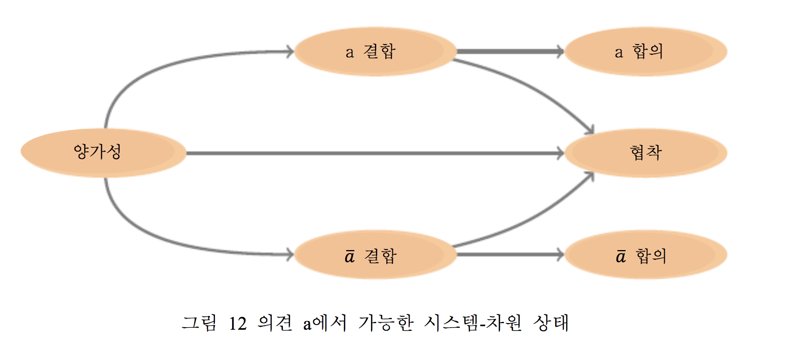

증명. B를 오염된 노드의 DSet이라고 가정하고 U ⊈ B를 무결 노드가 이를 통해 a를 확인한 쿼럼으로 가정합니다. U⧵B의 노드들이 accept(a)를 브로드캐스트한다고 가정하겠습니다. 
정의에 따라, 임의 노드 v는, 어떻게 투표하였는지와 무관하게, v-차단 집합으로부터 accept(a)를 받은 후 a를 수락합니다. 따라서, 이들 메시지들은 더 많은 노드가 a를 수락하도록 설득할 수 있습니다. 
이어서, 이렇게 추가되는 노드들이 한 지점에 도달할 때까지 accept(a)를 차례대로 브로드캐스트한다고 가정합니다. 이 지점은, 그 이후의 통신과 무관하게, 더 이상 그 어떤 무결 노드도 a를 수락하지 못할 때입니다. 
이 지점에서 S를 a의 수락을 주장하는 노드 집합으로 가정하고(이때, U ⊆ S이다), S+를 S의 온전한 노드 집합이라고 가정하고, S−를 S에 없는
온전한 노드 집합으로 가정합니다. S+는 그 어떤 S−의 임의 노드에 대해서도 v-차단이 될 수 없거나, 또는 더 많은 노드가 a를 수락하기 위해 올 수있습니다.그렇다면 정리 10에 의하여,S− =∅이며,이것은 모든 무결 노드가 a를 수락했다는 의미입니다.

그림 11은 무결 노드 v가 a를 확인하기 위해서 취할 수 있는 경로들을 요약합니다. 아무 것도 모르는 상태라면, v는 a 또는 모순되는 ̅에게 투표할 수도 있습니다. 
만일 v가 ̅에게 투표하는 경우, 이후 a에게는 투표하지 못합니다. 하지만, 만일 v-차단 집합이 a를 수락하게 되면 그럼에도 불구하고 a를 수락할 수 있습니다. 확인 메시지들의 후속 쿼럼은 v가 a를 확인하도록 합니다. 이것은 정리 11에 따라 시스템이 a에 합의한다는 의미입니다. 

### 5.6 활동성과 중화 ( Liveness & Neutralization ) 

분산 합의(distributed consensus)의 주요 난점은, 중앙집중화이던 아니던, 의견이 시스템에서 이에 대한 합의에 도달하기 전에 영구 미정 상태로 교착될 수 있다는 점입니다. 
따라서, 프로토콜은 외부화된 값을 직접적으로 비준하려고 시도하면 안 됩니다. 만일 “슬롯 i 값은 x이다”라는 의견이 교착되면, 시스템에서 슬롯 i에 대한 합의는 영구히 불가능합니다. 즉, 활동성을 잃어버립니다. 
해결 방법은 투표 중인 의견을 신중하게 조작하는 것입니다. 정말 관심을 두고있는 문제인, 즉 슬롯 내용, 에서 교착 문구의 고정을 반드시 극복할 수 있어야 합니다. 협착 문구를 폐기시키는 과정을 중화라고 호칭합니다. 

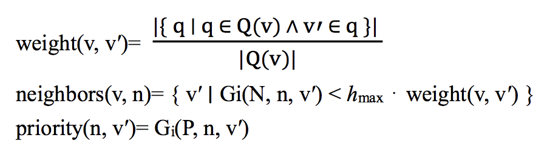

보다 구체적인 표현을 하면, 그림 12는 의견 a가 시스템 전체에서 가질 수 있는 잠재 상태를 기술합니다. 

초기엔, 시스템은 양가성이었으며, 이것은 가능한 이벤트의 시퀀스가 한개 있으며 모든 무결 노드가 이를 통해 a를 수락하고, 그리고 또 다른 시퀀스가 존재해서 이를 통하여 모든 온전한 노드가 a를 거부합니다 (즉, a에 모순되는 의견 ̅를 승인합니다). 
어느 시점에는 이 두 개 결과 중 하나가 불가능하게 될 수 있습니다. 만일 그 어떤 무결 노드도 a를 절대 거부하지 못하는 경우, 시스템이 a-결합 상태라고 말합니다. 
이와 반대로, 어떤 무결 노드도 a를 절대 수락하지 못하는 경우, 시스템이 -a-결합 상태라고 말합니다.

FBAS가 양가성에서 a-결합으로 전환되는 시점의 경우에는 모든 무결 노드가 a를 수락하는 결과가 나올 가능성도 있습니다. 
그러나, 이런 결과가 아닐 수 도 있습니다. PBFT-유사 4개 노드 시스템 {v1, ... , v4}를 검토합니다. 이 경우, 임의의 세 개 노드가 쿼럼을 구성합니다. 만일 v1 및 v2가 a에 투표한다면, 시스템은 a- 결합으로 됩니다.
세개노드가모순되는의견을비준할수는없습니다.그러나,만일v3 및v4가곧바로a에 모순하는 ̅에 투표하면, 마찬가지로 a 비준은 불가능하게 됩니다. 이 경우, a의 상태는 영구 불확정, 또는 교착상태가 됩니다.

그림 10 a) 내용과 같이, 설령 온전한 노드가 a를 수락하더라도, 시스템은 a에 대한 시스템 전체 수준의 합의에 실패 할 수도 있습니다. 
그러나, 정리 11에 따라, 일단 온전한 노드가 a를 확인하면, 모든 온전한 노드는 최종적으로 수락을 할 수 있습니다. 따라서, 시스템은 a에 대해 합의를 하게 된 것입니다. 
그림 13은 온전한 노드가 자신의 로컬 상태로부터 의견의 전역상태에 대해 얼마나 알고있는지를 요약합니다.

합의 가능성을 유지하려면, 프로토콜은 모든 의견이 반드시 다음 둘 중 하나라고 보장해야 합니다. 반박불가하거나 (따라서, 교착 불가능) 중화가능(neutralizable)(따라서, 교착 시 진행 차단 불가능)입니다. 
중화가능한 의견 조작 시 선호하는 두 가지 접근법이 있습니다. 뷰-기반 접근법이 그 하나이며, 이것은 뷰스템프 복제 [Oki and Liskov 1988] 방법으로 탄생했고, PBFT [Castro and Liskov 1999] 방법에서 선호합니다. 
두 번째는 선거-기반 접근법으로, 팍소스(Paxos)가 만들었습니다 [Lamport 1998]. 선거-기반 접근법은 더 이해하기 어려울 수도 있습니다 [Ongaro and Ousterhout 2014]. 
더욱 혼란스럽게 만드는것은 사람들이 종종 뷰스템프 복제를 “팍소스”라고 하거나 두 가지 알고리즘이 다른 경우에도 같다고 우기기도 합니다 [van Renesse et al. 2014].

뷰-기반 프로토콜은 투표에 있는 슬롯들을 단조적으로 증가하는 뷰 개수와 연결시킵니다. 만일 뷰 n에 있는 i 번째 슬롯에서 합의가 교착되면, 노드는 뷰 n에는 i 개 이하의 유의미한 슬롯 개수가 있다고 합의하고 상위 뷰 번호로 진행하여 복구합니다. 
선거-기반 프로토콜은 투표에 있는 값과 단조적으로 증가하는 선거 번호를 연결시킵니다. 만일 선거가 교착되면, 노드는 동일한 슬롯을 더 높은 선거를 사용하여 다시 시도합니다. 이때 과거의 교착 선거와 모순될 수 있는 값을 절대 선택하지 않도록 조심합니다.

본 논문은 선거-기반 접근법을 취합니다. 이에 따라 식별된 주요 노드 또는 리더라는 개념 제거가 용이하게 됩니다. 예를 들어, 리더 행동을 에뮬레이트할 수 있습니다 [Lamport 2011b]. 

## 6. SCP: 연합형 비잔틴 합의 프로토콜

본 섹션은 SCP(스텔라 합의 프로토콜)를 논의한다. 높은 레벨의 경우, SCP는 두 개의 서브 프로토콜인 추천 프로토콜 및 선거 프로토콜로 구성된다:

추천 프로토콜은 슬롯의 후보 값을 만듭니다. 만일 충분히 오래 실행하게 되면, 최종적으로는 모든 무결 노드에서 동일한 후보 값 집합을 산출합니다. 
이것은 노드가 그 슬롯을 위해 단일 복합 값을 산출하기 위해서 후보 값을 결정론적인 방식으로 결합할 수 있다는 의미입니다. 그러나, 큰 주의 사항이 두 가지가 있습니다. 
우선, 노드로서는 추천 프로토콜이 수렴 지점에 언제 도달하는지 알 수 있는 방법이 없습니다. 두 번째, 수렴 이후에도, 악의적으로 행동하는 노드는 추천 과정을 한정된 횟수동안/만큼 재설정할 수 있습니다.

노드는 추천 프로토콜이 수렴했다고 추측을 할때, 선거 프로토콜을 실행합니다. 이는 복합 값과 관련된 선거의 커밋 및 중단을 위해서 연합 투표를 이용합니다. 
무결 노드가 선거 커밋에 합의한 경우에는, 선거에 관련된 값은 해당(논의 되고 있는) 슬롯을 위해 표면화됩니다. 이들이 선거 중단에 합의하는 경우, 선거값은 무의미하게 됩니다. 
만일 선거가 하나 이상의 온전한 노드가 커밋이나 중단을 하지 못하는 상태에서 교착되는 경우, 노드는 더 높은 선거로 다시 시도합니다. 이들은 새로운 선거를 교착된 값과 동일한 값과 관련시킵니다. 
이는 어떤 노드가 교착된 선거가 실행되었다고 믿는 경우에 대비해서입니다. 직관적으로 보면, 모든 교착 및 커밋한 선거가 동일한 값과 관련된 것을 보장하면 안전성이 도출됩니다. 교착된 선거는 더 높은 선거로 진행하여 중화시킬 수 있다는 사실에 따라서 활동성이 도출됩니다.

본 섹션의 나머지 부분에서는 추천 및 선거 프로토콜을 논의합니다. 이들 각각을 우선 개념적 구문의 측면에서 기술하고, 그 후 개념적 구문들의 집합들을 표현하는 메시지가 있는 구체적인 프로토콜로 기술합니다. 
마지막으로, 섹션 6.3에서는 프로토콜의 정확성을 제시합니다. SCP는 각 슬롯을 완전히 독립적으로 취급하며, 단일 슬롯 합의 프로토콜의 수많은 별도 사례/인스턴스로 볼 수 있습니다 (팍소스의 “단일 규칙 시노드”와 유사하다 [Lamport 1998]). 
후보 값과 선거 등과 같은 개념들은, 논의의 많은 부분에서 슬롯이 내포된채 남아있더라도, 언제나 특정 슬롯의 맥락에서 해석되어야만 합니다. 

### 6.1 추천 프로토콜 

슬롯은 부분 정렬만 되어있으면 되므로, 일부 SCP 어플리케이션에서는 예상 선거를 슬롯 당 한 개만 갖습니다. 
예를 들어, 인증서 투명성의 경우, 각 CA는 각자 자기 고유의 일련의 슬롯들을 가지고 있을 수 있으며 정확하게 슬롯 당 인증서 트리 하나에 서명합니다. 그러나, 다른 적용법들은 슬롯 당 많은 타당한 값들을 인정합니다. 
이런 경우에는 가능한 입력값들을 좁히는 것도 좋습니다. 본 논문은 동기 추천 프로토콜로 시작하는 방법을 채택합니다. 이것은 특정한 타이밍 가정 하에서 합의를 달성하고, 추천 프로토콜 결과를 (안전성이 타이밍에 의존하지 않는) 비동기 선거 프로토콜에 제공합니다 [Lamport 2011a]. 
이런 초기 동기 단계를 종종 중재자라고 부릅니다 [Aspnes 2010].

추천 프로토콜은 한 슬롯에서 한 개 집합의 후보 값에 대한 수렴을 통하여 작동합니다. 그 후 노드는 이들 후보 값을 해당 슬롯에 대한 단일 복합 값으로 결정론적으로 결합합니다. 값을 결합하는 정확한 방법은 활용법에 따라 다릅니다. 
한 예로서, 스텔라 네트워크는 SCP를 사용하여 각 슬롯에 맞게 한 개의 트랜잭션의 집합과 원장 타임스탬프를 선택합니다. 
후보 값을 결합하려면, 스텔라는 트랜잭션 집합들의 합집합을 취하고 해당 타임스탬프들의 최대값을 취합니다. (무효한 타임스탬프가 있는 값은 후보가 되기에 충분한 추천을 받지 못합니다.) 
기타 다른 가능한 접근법에는 교차를 통한 집합 결합법 또는 단순히 가장 높은 해시를 가진 후보 값 선발법이 있습니다..

노드는 의견 추천 x에 대한 연합 투표를 통하여 후보 값 x를 만듭니다.

후보(Candidate) 정의 v가 의견 추천 x를 확인한 경우, 즉 v가 accept(nominate x)를 비준한 경우, 노드 v는 값 x를 후보라고 판단합니다.

노드 v가 후보 값이 없는 한 v는 추천 x를 위해 투표할 수 있으며, 이때 x의 값은 어플리케이션-레벨 유효성 검사를 통과해야합니다(예를 들어, 장래에 있지 않은 타임스탬프). 
사실상, 다른 노드들이 어떤 임의 값를 추천하는 것을 파악한 경우, v는 일반적으로 그 임의 값에 대해 다시 추천해야 합니다. 이때, 후보들의 폭발적인 증가를 방지하기 위해서 어느 정도 수준을 제한합니다(아래 논의). 
그러나, v가 후보 값을 갖는 즉시 새로운 임의 값 x에 대해 추천 x에 대한 투표를 중지해야 합니다. 그러나, 연합형 투표 절차에 지정된 것과 같이 새로운 값의 추천 의견 수락을 계속해야 하며(v-차단 집합에서 수락되는 경우), 새로운 추천 의견을 확인해야 합니다.

시스템에 무결 노드가 있는 경우, 추천 프로토콜에는 몇 가지 특성이 허용됩니다(즉, 완전한 장애는 회피했다는 의미이다). 특히, 각 슬롯에 대해:

(1)  온전한 노드는 최소 한 개의 후보 값을 산출할 수 있습니다.

(2)  어느 시점이 되면 예상되는 후보 값이 성장을 중지합니다.

(3)  만일 임의의 온전한 노드가 x를 후보 값으로 간주하면, 최종적으로는 모든 온전한 노드가 x를 후보 값으로 간주합니다. 

이제 추천 프로토콜이 이 세 가지 특성을 달성하는 방법을 검토합니다. 추천 의견은 반박불가하므로 특성 1은 달성됩니다. 노드는 특정한 값을 후보로 만드는 데 반하는 투표를 절대로 하지 않습니다. 
그리고, 첫 번째 후보 값이 확인되기 전까지 온전한 노드는 임의 값을 추천하기 위해 투표할 수 있습니다. 임의 값 x가 어플리케이션-레벨 유효성 검사를 통과하는 한, 온전한 노드는 이에 투표하고 추천 x를 확인할 수 있습니다. 
일단 각 온전한 노드가 최소 한 개의 후보 값을 확인하면 (이는 유한한 시간 내에 발생된다), 새로운 값을 지닌 후보를 추천하기 위해 투표하는 온전한 노드는 없기 때문에 특성 2는 보장됩니다. 
따라서, 후보가 될 수 있는 유일한 값들은 무결 노드에게서 이미 투표를 받은 경우입니다. 특성 3은 정리 11의 직접적인 결론입니다.

만일 참여하는 값 조합 개수가 적어지면 추천 과정은 더욱 효율적으로 됩니다. 따라서, 노드에 임시 우선순위를 할당하고, (가능한 경우) 각 노드가 높은 우선순위 노드와 동일한 값을 추천하게 합니다. 
보다 구체적인표현을하면,H를암호해시함수라고가정하고,이때그범위는정수집합{0,...,hmax −1}로 해석합니다.

(H는 SHA-256 [National Institute of Standards and Technology 2012]일 수 있으며, 이 경우, hmax = 2256입니다.)
Gi(m) = H(i, xi−1, m)를 슬롯 i를 위한 슬롯-특정 해시 함수로 가정합니다. 이때, xi−1은 i 이전의 슬롯을 위하여 선택한 값입니다 (또는, 슬롯이 부분 정렬로 통제될 때 슬롯 i의 모든 직접적인 의존성들의 정렬 값의 집합입니다). 
슬롯 i 및 반복 횟수 n 지정 시, 각 노드 v는 다음과 같이 한 개 집합의 이웃 및 각 이웃을 위한 우선순위를 계산합니다:

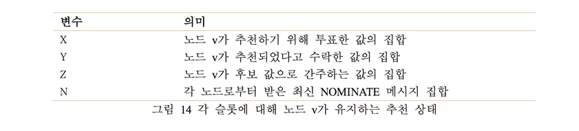

N 및 P는 두 개의 상이한 해시 함수를 산출하는 상수입니다. 함수 weight(v, v′)는 v′를 포함하는 Q(v)의 슬라이스 분수를 반환합니다.

weight 함수를 v′가 neighbors(v, n)에 나타난 n에 대한 확률로 사용하면, 큰 신뢰성이 없는 노드가 한 단계를 지배하게 되는 확률도 낮춥니다.

각 노드 v는 초기에 노드 v0 ∈ neighbors(v, 0)를 찾아야 하며, 이는 자기가 의사소통이 가능한 노드 중에서 priority(0, v0)를 최대화하고, 그 후 v0과 동일한 값을 추천하기 위해 투표할 수 있어야 합니다.
v = v0인 경우에만 v는 새로운 값 추천을 도입해야 합니다. v는 시간제한을 사용하여 투표하려는 새로운 추천 의견을 결정해야 합니다. 
n 시간제한 후, v는 priority(v, vn)을 최대화하는 노드 vn ∈ neighbors(v, n)를 찾아야 하며, vn가 추천한다고 투표한 모든 것에 대해 추천한다고 투표해야 합니다. 

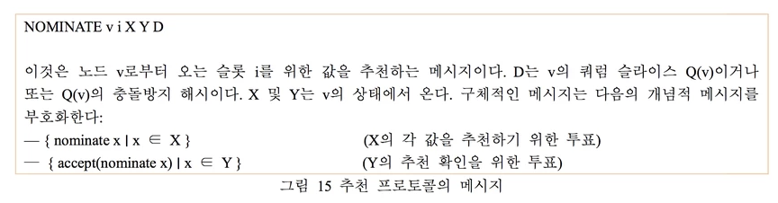

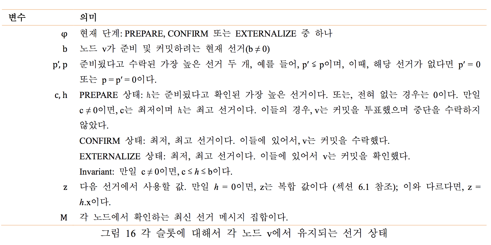

정리 12. 최종적으로, 모든 무결 노드는 동일한 복합 값을 지닙니다.

증명. 추천 프로토콜의 세 개 특성으로부터 정리가 도출됩니다. 온전한 각 노드는 한정된 수의 선거를 추천하기 위해서만 투표합니다. 
악의적으로 행동하는 노드의 활동이 없는 경우, 온전한 노드는 Z라고 하는 동일한 후보 값 집합에 모여듭니다. 
본 수렴(convergence)을 선점하기 위해, 악의적으로 행동하는 노드는 새로운 후보 값들을 도입할 수 있습니다. 
이는 한동안 몇몇 무결 노드에서 후보가 될 수 있으나, 모든 온전한 노드에서는 아닙니다. 본 값은 선하게 행동하는 노드로부터 표를 얻어야만 합니다. 그러나, 이것은 유한 집합으로 제한됩니다. 
최종적으로, 악의적으로 행동하는 노드는 시스템 교란을 중지하거나 주입할 새로운 후보 값이 부족하게 됩니다. 이 경우, 온전한 노드는 Z로 수렴합니다. 

#### 6.1.1 구체적인 추천 프로토콜

그림 14에는 각 슬롯에 대해 노드 v가 반드시 유지해야 하는 추천 프로토콜 상태가 나와 있습니다. X는 v가 추천 x에 투표한 값들 x의 집합이며, Y는 v가 추천 x를 수락한 값의 집합입니다. 그리고, Z는 후보 값 집합입니다. 
즉, v를 포함한 쿼럼이 수락(추천 x)이라고 말한 모든 값입니다. 마지막으로, v는 가장 최근의 각 노드에서 온 확실한 메시지인 N을 유지합니다. (기술적으로, X, Y, Z는 모두 N으로부터 재계산할 수 있습니다. 그러나, 직접 참조하는 것이 용이합니다). 
네 개의 필드 전체는 공집합으로 초기화됩니다. 전체 세 개 X, Y, Z는 시간이 지날수록 증가함에 유의하십시오. 노드는 이 집합들에 있는 값을 절대로 제거하지 않습니다.

그림 15는 추천 프로토콜을 구성하는 확실한 메시지를 제시합니다. X와 Y는 시간에 따라 단조적으로 증가하므로, D가 중간-추천을 변경하지 않는 한 (또는 D를 업데이트 해야하지 않는 한) 
동일한 노드에서 온 여러 개의 NOMINATE 메시지 중 어느 것이 가장 최근인지, 네트워크 전송 순서와 관계없는지(독립적임) 결정할 수 있습니다. 추천하려면 원격 프로시저 호출 (RPC) 한 개만 필요합니다. 
인수는 송신측의 최신 NOMINATE 메시지이며 반환 값은 수신측의 최신 메세지입니다. 만일 D 또는 추천된 값이 암호 해시라면, 필요에 따라서 두 번째 RPC가 언캐시 해시 프리이미징 검색을 허용해야 합니다.

노드는 어차피 추천 프로토콜이 완료되는 시점을 전혀 확인할 수 없으므로, SCP는 상이한 노드에서 상이한 복합 값에 반드시 대처해야 합니다.

그러면, 최적화 단계로, 노드는 후보 값을 갖기 전이라도 최종 복합 값에 대한 예측을 시도할 수 있습니다. 이를 위해, Z ≠ ∅일때 combine(Z)로 복합 값을 취할 수 있습니다. 
또는, Y ≠ ∅이라면 combine(Y)이며, X ≠ ∅일때는 combine(X)입니다. 이것은 다음과 같은 의미입니다. 최고 우선순위 노드는 최초 NOMINATE 메시지에 PREPARE(차후 설명) 메세지를 편승하여, 추천과 동시에 선거를 긍정적으로 시작할 수 있습니다. 

### 6.2 선거 프로토콜 

노드가 복합 값을 지니게 되면, 선거 프로토콜에 참여합니다. 물론, 추천은 복합 값을 동시에 계속해서 업데이트하고 있을 수도 있습니다. 선거 b는 형태 b = ⟨n, x⟩의 한 쌍입니다. 
이때, x ≠ ⊥는 값이며, b는 해당 슬롯에서 x 외부화에 대한 레퍼렌덤입니다. 값 n ≥ 1은 더 높은 선거 번호를 항상 사용할 수 있도록 보장하는 카운터입니다. 본 논문은 C-형태의 표기법 b.n 및 b.x를 사용하여 선거 b의 카운터 및 값 필드를 표시합니다. 
따라서 b = ⟨b.n, b.x⟩와 같습니다. 선거는 완벽하게 정렬되있고, b.x보다 b.n이 더 유의미합니다. 편리하게 하기 위해서, 특수 무효 널 선거 0 = ⟨0, ⊥⟩은 다른 모든 선거에 비해 작으며, 특수 카운터 값 ∞는 다른 모든 카운터보다 큽니다.

선거 b에 대한 커밋과 중단을 표기하는걸 연합 투표를 사용하여 의견들 커밋 b 또는 중단 b 각각에 대해 합의하는 것의 간단한 표기 방법입니다. 
지정된 선거에 있어서, 커밋과 중단은 모순되는 상황이며, 그렇기 때문에 선의로 행동하는 노드는 최대 이들 중 하나에 투표합니다. 섹션 5의 표기법에 따르면, 커밋 b의 반대는 “커밋 𝑏”가 되어야 하지만, 중단 b가 보다 직관적인 표기법입니다. =

주어진 슬롯에서 최대 한 개의 값을 선택할 수 있으므로, 모든 커밋 및 교착 선거에는 동일한 값이 반드시 포함되어야 합니다. 크게 보아, 만일 커밋 의견들이 낮은 번호의 중단되지 않은 선거들과 충돌이 발생하면, 이것은 커밋 의견들이 무효하다는 의미입니다.

호환 (compatible) 정의. 두 개의 선거 b1 및 b2는 b1.x = b2.x이어야만 호환된다고 하며, b1 ∼ b2로 표기합니다. 비호환의 경우는 b1 ≁ b2로 표기하며, 필요충분조건은 b1.x ≠ b2.x입니다. 또 b1 ≤ b2 (또는 이와 동등하게 b2 ≥ b1) 및 b1 ∼ b2여야만 
b1 ≲b2 또는 b2 ≳b1이라고 표기합니다. 이와 비슷하게,b1 ⋦b2 또는 b2 ⋧b1은 b1 ≤b2 (또는 이와 동등하게 b2 ≥b1) 및 b1 ≁b2를 의미합니다.

준비 (Prepared)정의 . 다음의 집합 내 각 의견이 참일 경우에만 선거 b가 준비됩니다:{abortbold ∣bold ⋦b}. 

 보다 명료하게 말하자면, 커밋 b의 준비가 확인된 경우에만 b는 투표하기에 유효합니다. 본 노드는 상응하는 중단 의견에 대해 연합 투표를 통해서 준비 확인을 보장합니다. 
이 의견들에 대해 집단으로 투표하는 편이 용이합니다. 따라서, “b는 준비된 상태”라고 표기하면 항상 그 주변 상황을 중단 의견의 전체 집합에 적용합니다. 특히, 한 노드는 이 모든 중단을 각각 승인 또는 확인하는 투표를 해야만 b가 준비되었다고 투표, 승인 또는 확인합니다.

선거 b를 커밋하거나 그 값 b.x를 표면화하려면, SCP 노드는 우선 b가 준비되었다고 수락 및 확인을 해야합니다. 그 후, 커밋 b를 수락 및 확인합니다. 
첫 번째 온전한 노드가 커밋 b에 투표하기 전, 연합 투표를 통한 준비 단계가, 모든 온전한 노드가 최종적으로 b가 준비된 것을 확인할 수 있다고 보장합니다. 온전한 노드 v가 커밋 b를 승인하는 것은 b.x가 최종적으로 선택된다는 의미입니다. 
그러나, 섹션 5.4.1에서 논의한 바와 같이 v가 오염된 경우에 대비해서 커밋을 처리하기 전에 v는 커밋을 반드시 확인해야 합니다. 

#### 6.2.1 구체적인 선거 프로토콜

그림 16은 각 노드에서 유지하는 슬롯 당 상태를 보여줍니다. 노드 v는 다음 사항을 저장합니다: 
현재 단계 g; 현재 선거 b; 준비한 가장 최근의 비호환 선거 두 개 (p, p′); 가장 낮은 (c) 가장 높은 (h) 선거, 해당 경우, 커밋을 위해 투표했으며, 이 경우 곧바로 중단을 승인하지 않았습니다
(또는, 그 후 단계에서 커밋을 수락하거나 확인했습니다); 현재 선거가 실패하는 경우 시도할 다음 값 z ; 그리고, 각 노드에서 받은 최신 메시지(M). 선거들 b, p, p′ 그리고 h는 한 단계 내에서는 감소하지 않습니다. 
또한, 만일 c ≠ 0인 경우 (즉, 커밋 c 비준에 v가 참여했을 수도 있다는 의미) 코드는 c ≲ h ≲ b를 반드시 보장해야 합니다. 이 불변부분은 노드가 항상 현재 선거 b를 준비하는 적법한 투표를 할 수 있도록 보장합니다. 

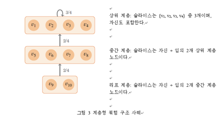

그림 17은 선거 프로토콜 메시지 세 개를 보여줍니다. 이때, 노드가 셋 중 어떤 것을 보낼지 φ로 결정합니다. 선거 메시지는 추천 메시지와 중첩될 수 있습니다. 따라서, h = 0인 경우, 노드는 NOMINATE 메시지에 맞게 z를 업데이트 할 수도 있습니다. 
“a ∨ accept(a)”는 수락의 정의 조건 1 하에서 쿼럼이 a를 승인하려면 각 노드가 반드시 승인해야 하는 것이라는 점에 유의하십시오.

편의를 위해, 노드들 전체에 걸쳐서 상태를 비교할 때, 첨자를 이용하여 특정한 노드에 속한 필드를 식별합니다.만일 v가 어떤 노드 라면, 그림16 에서 보는 것 과 같이,bv,pv,p′v ,...라고 표기하여 
노드v의 상태에서 b, p, p′, ...의 값을 표시합니다. 이와 비슷하게, vm은 메시지 m의 송신측을 표시한다고 가정하며, bm, pm,p′m ,...은 m이 암시하는 vm의 상태에 있는 값 b,p,p′,...에 상응하는 값을 표시한다고 가정합니다.

각 노드는 φ ← PREPARE, z ← ⊥, b ← ⟨0, z⟩, M ← ∅으로 설정하여 슬롯에 있는 선거 상태를 초기화합니다. 그리고, 다른 모든 필드 (p, p′, c, h)를 무효한 선거 0으로 초기화합니다. 
z = ⊥인 경우, 노드는 선거 메시지를 받을 수는 있으나 보내지는 못합니다. 일단 z ≠ ⊥로 되면 (만일 b.n = 0인 경우), 노드는 b ← ⟨1, s⟩로 재초기화하여 메시지 전송을 시작합니다. 
그 후 노드는 피어와 반복적으로 메시지를 교환하고, 이때 g가 표시하는 모든 선거 메시지를 전송합니다. 새로 수신한 메시지 m을 Mv에 추가하면, 노드 v는 다음과 같이 상태를 업데이트합니다:

(1)  만일φ=PREPARE 이며 m이 v가 새로운 선거를 준비된 상태로서 수락할 수 있게하면, p 및 p′를 업데이트 합니다. 그 후, 만일 p⋧h 또는 p′⋧h 상태이면,c←0 설정합니다.

(2)  만일 φ=PREPARE이며 m이 v가 새로운 상위 선거를 준비됬다고 확인할 수 있게 하면,h를 해당 선 거의 최고 상태로 올리고 z ← h.x로 설정합니다.

(3)  만일 φ=PREPARE,c=0,b≤h이며,p⋧h도 p′⋧h도 아니라면,c를 b≤c≲h를 만족시키는 최저 선거 상태로 합니다. 

(4)  만일φ=PREPARE 이고 v는 하나 이상의 선거를 위해 커밋을 수락하면, c를 해당 선거의 가장 낮은 상태로 한 후,h를 최고 선거 상태로 하여 v가 모든 {commitb′∣c≲b′≲h}를 수락하도록 하고,φ← CONFIRM을 설정합니다. 
또한,h 업데이트 후 z←h.x 설정하고,h≲b가 아닌 이상,b←h 설정을 합 니다.

(5)  만일 φ=CONFIRM이고 수신한 메시지는 v가 새로운 선거를 준비된 것으로 수락할 수 있게 하면,p 를 최고 수락 준비 선거로 만듭니다. 이로써, p ∼ c로 됩니다.

(6)  만일φ=CONFIRM이며 v가 추가 커밋메시지를 수락하거나 b를올리면,h′를 가장 높은 선거로 가정합니다. 그래서 v가 모든 {commitb′∣b≲b′≲h′}를 수락하도록 합니다.(해당 경우). 
만일 이와 같 은 h′ 및 h′>h가 있는 경우,h←h′ 설정 후, 필요한 경우,c를 가장 낮은 선거로 만듭니다. 그래서 v 가 모든 {commitb′∣c≲b′≲h}를 승인하도록 합니다.

(7)  만일φ=CONFIRM이고 v는 임의 c′에대해 커밋c′를 확인하면, c 및 h를 해당 선거의 최저 및 최고로 설정합니다. φ ← EXTERNALIZE 설정 후, c.x를 외부화하고, 종료합니다.

(8)  만일 φ ∈ {PREPARE, CONFIRM}이며 b < h인 경우, b ← h 설정을 합니다.
 
(9)  만일φ∈{PREPARE,CONFIRM} 및 송신자들의 집합 {vm′∣m′∈S}은v-차단및∀m′∈S,bm′ .n > bv.n이 되는 ∃S ⊆ Mv인 경우, b ← ⟨n, z⟩ 설정을 합니다. 
이때 n은 해당 S 값이 존재하지 않는 최저 카운터입니다. b를 업데이트 한 후 과거 단계를 반복합니다. 

c = 0일 동안, 위의 프로토콜은 연합 투표를 수행하여 b가 준비된 것을 확인합니다. 일단 c ≠ 0이 되면, 프로토콜은 각 c ≲ c′ ≲ h에서 커밋 c′에 대해 연합 투표를 수행합니다.
CONFIRM 단계의 경우, 선의로 행동하는 노드가 일단 커밋 c를 수락하면, 노드는 임의 c′ ≁ c에서의 커밋 c′를 절대로 승인하지 않고, 따라서 절대로 확인을 시도하지 않습니다. 
일단 커밋이 확인되면, 해당 선거의 값은, 쿼럼 교차를 가정하여, 외부화하기에 안전합니다.

특정한 노드가 전송한 모든 메시지는 ⟨ φ, b, p, p′, h⟩에 의해 완벽하게 정렬됩니다. 이때, φ 는 가장 중요한 필드이며 h는 중요도가 가장 낮은 필드입니다. 
이들 필드의 값은 그림 17의 설명과 같이 메시지에서 결정될 수도 있습니다. 모든 PREPARE 메시지들은 모든 CONFIRM 메시지보다 앞서며, 
이 CONFIRM 메세지가 이번에는 주어진 슬롯에서 단일 EXTERNALIZE 메시지보다 앞섭니다. 본 정렬은 M이 메시지 정렬 타이밍에 의존하지 않으며 각 노드의 최신 선거만 담는 것을 보장가능하게 합니다. 
이는 네트워크가 메시지를 재정렬할 수 있기 때문이다.

프로토콜의 몇 가지 세부 사항은 설명할 가치가 있습니다. “abort b′ ∨ accept(abort b′)” 형식의 PREPARE으로 암시된 의견들은 v가 중단 b′에게 투표를 하는지 또는 확인하는지 여부를 명시하지 않습니다. 
수락의 정의에서 이런 구분은 중요하지 않습니다. (따라서, 중단에 투표하지 못합니다). 실제, c ≠ 0일때 v가 c를 수정하는 유일한 때는 
이전 페이지의 단계 1에서 커밋으로 투표한 각 선거에 대해 중단을 수락한 후, c를 0으로 다시 설정할 때입니다. 
이와 반대로, c = 0일때 v가 c를 수정하는 유일한 때는 단계 3에서 c를 값 c ≥ b로 설정할 때입니다. 임의 c ≥ b에서 노드는 중단 c에 절대로 투표하지 않으므로, 이전의 어떤 중단 투표도 커밋 c와 절대로 충돌하지 못합니다.

정리 11은 노드가 수락한 것에 대해서 다시 브로캐스팅하도록 요구합니다. 이것은 준비 정의에 따릅니다. 즉, 노드가 준비된 상태라고 수락한 두 개의 최고 비호환 선거는 노드가 준비된 상태라고 수락한 모든 선거를 포함합니다. 
따라서, p 및 p′를 각 메시지에 포함시키는 것은 노드가 h(확인된 준비된 선거)에 수렴하는 것을 보장합니다. 또한 다음에 유의해야 합니다. 노드가 준비된 상태라고 수락하는 선거들은 반드시 노드가 준비된 상태라고 확인하는 선거의 초집합이어야 한다. 
따라서, 단계 2는 h ≁ c ≠ 0으로 h를 설정하지 못합니다. 이는, 만일 새로운 h가 기존 c와 비호환인 경우 단계 1이 c←0을 설정하기 때문입니다. 

v가 EXTERNALIZE 메시지를 전송하는 시점에서는 v는 { commit b′ ∣ b′ ≳c }를 수락했습니다. 그러나 보다 중요한 것은 {commitb′∣c≲b′≲h}를 확인했다는 사실입니다. 
그 슬라이스 중 하나가 만장일치로 합의한 것을 이미 점검했기 때문에 v는 Q(v)와 무관하게 확인된 의견의 수락을 주장할 수 있습니다. 이것으로 EXTERNALIZE 설명에 있는 두 번째 암시적 CONFIRM 메시지에서 D를 대신하여 {{v}}가 나타나는 것이 설명됩니다. 
D를 삭제하므로 단일 정적 EXTERNALIZE 메시지가, 그 사이에 쿼럼 슬라이스가 크게 변경된다고 해도, 먼 미래에 다른 노드들이 임의로 따라갈 수 있도록 돕는걸 허용합니다.

선거 메시지 교환에는 RPC 단 하나만 필요합니다. 인수(argument)는 송신측의 최신 메시지이며 반환 값은 수신측의 최신 메시지입니다. NOMINATE와 마찬가지로, 
만일 D 또는 선거의 값들 x가 암호 해시라면, 언캐시 해시 프리이미징(unchached has preimages)을 검색하기 위해서 별도의 RPC가 필요합니다. 

### 시간제한과 선거 업데이트

만일 모든 무결 노드가 동일한 선거 b로 시작한다면, 이전 페이지의 단계 1부터 9는 커밋 b을 확인 및 값 b.x를 외부화하기에 충분합니다. 
불행하게도, 만일 선거 프로토콜이 추천 프로토콜 수렴 도달 전에 시작한다면, 노드는 z에 대해 다른 값들로 시작할 수도 있습니다. 만일 선거가 실패하거나 또는 매우 오래 걸려서 무응답 노드들때문에 실패할 수 있다면, 
노드는 반드시 시간제한에 따라 잠시 중지하고 더 높은 선거를 이용하여 다시 시도해야 합니다. 이런 이유로, 노드는 다음과 같이 타이머를 채택합니다:

(a)  φv ≠ EXTERNALIZE인 노드 v는 어느 때라도 ∃S ⊆ Mv이면 타이머를 준비합니다. 이때 송신측 집합 U = { vm ∣ m ∈ S }는 쿼럼이 되며, v ∈ U 및 ∀m ∈ S, bm.n ≥ bv.n이 됩니다.

(b)  만일 타이머가 시작되면, v는 bv ← ⟨bv.n + 1, zv⟩설정하여 선거를 업데이트합니다.

다른 노드들은 각자 다른 시간에 선거를 시작할 수 있습니다. 그러나, 조건 (a)는 쿼럼보다 앞서간 노드 v에 타이머를 설정하는 것을 지연시킵니다. 
이와 반대로, 이전 페이지의 단계 9는 따라가기에 너무 뒤쳐진 노드들이 타이머를 기다리지 않고 따라잡을 수 있게 합니다. 통합하면, 이 규칙들은 충분히 길게 타이머를 설정하면 무결 노드가 동일한 선거에서 함께 시간을 보내며, 
또한, 그 시간이 타이머 경과에 따라 비례적으로 증가한다는 것을 보장합니다. 지연이 예상되지 않는 수준에서 시간제한이 충분히 길도록 보장하려면, 구현 시 b.n 함수로 시간제한을 증가시킬 수 있습니다. 

### 6.3 정확성

SCP 노드는 모든 낮은 번호의 비호환 선거에 있어서 중단 확인을 위한 투표를 완료하기 전까지는 커밋 b 확인을 위해 투표하지 못합니다. 선의로 행동하는 노드는 모순되는 의견을 수락하지 못하므로 (따라서, 확인을 위한 투표도 못함), 
이는 주어진 ⟨V, Q⟩에서 정리 5는 S가 V⧵ S에도 불구하고 쿼럼 교차를 허용하는 한 선의로 행동하는 노드 집합 S는 모순되는 값을 외부화하지 못한다는 것을 보장한다는 의미입니다. 만일 V 및 Q가 슬롯들 사이에서만 바뀐다면 이 안전성은 유지됩니다. 
그러나, 만일 한 슬롯 중간에서 바뀌는 경우, 예를 든다면 노드 충돌에 대한 응답으로는 어떨까요?

재구성 하에서 안전성에 대한 추론을 위해, 기존 및 새로운 모든 쿼럼 슬라이스 집합을 결합시켰습니다. 이는 노드가 상이한 구성 시점에서 받은 메시지 조합을 기반으로 하여 의사 결정을 할 수 있다는 사실을 반영합니다. 
매우 보수적인 기준으로, 모든 이전 구성과 함께 현재 구성 집합체의 쿼럼 교차를 요구할 수도 있습니다. 그러나, 단순히 충돌만 유발시킨 노드들과 불법 메시지를 전송한 노드들을 분리하여 이것을 조금 완화시킬 수 있습니다.

정리 13. ⟨V1, Q1⟩, ... , ⟨Vk, Qk⟩를 단일 슬롯의 합의 동안 FBAS가 경험한 구성의 집합이라고 가정합니다. V = V1 ∪⋯∪Vk 및Q(v)={q∣∃j 이때,v∈Vj ∧q∈Qj(v)}를가정합니다.B⊆V를B가 불법 메시지를 전송한 
모든 악의 행동 노드를 포함하게 하는 집합이라고 가정합니다. 이때 V ⧵ B에는 충돌한 (무응답) 노드가 여전히 포함되어 있을 수 있습니다. 노드 v1과 v2는 선의의 행동을 하는 것으로 가정하고, 슬롯을 위해 v1은 x1을 표면화하고, v2는 x2를 표면화합니다. 
만일 ⟨V, Q⟩B가 쿼럼 교차를 허용하면, x1 = x2입니다.

증명. v1이 x1을 외부화하기 위해서는 의사-쿼럼 U1 ⊆ V와 협력하여 accept(commit ⟨n1, x1⟩)를 비준했어야 합니다. 비준에는 여러 개의 구성을 지닌 메시지 전달이 관련될 수 있으므로 ⟨Vj, Qj⟩에서 
임의의 특정 j에 대해 U1은 쿼럼이 아닐 수 있으므로 의사-쿼럼이라고 말합니다. 그럼에도 불구하고, 비준이 성공하려면 ∀v ∈ U1, ∃j, ∃q ∈ Qj(v)이어야 하며, 이때 q ⊆ U1입니다. 이것은 q ∈ Q(v)인 Q 구조에서 도출됩니다. 

따라서, U1은 ⟨V, Q⟩의 쿼럼입니다. 유사한 논거에 따라, 의사-쿼럼 U2는 accept(commit ⟨n2, x2⟩)를 비준했어야 하며,U2는반드시⟨V,Q⟩의쿼럼이어야합니다.⟨V,Q⟩B 쿼럼교차에따라서v∈U1 ∩U2인v∈V⧵B가 반드시존재해야합니다.가정에따라,이런v∉B는비호환선거의수락을주장하지못합니다.v가x1 및 x2가 있는 선거의 커밋 수락을 확인했기 때문에 반드시 x1 = x2가 되어야 합니다.

우선, 정리 13의 안전성 필요 조건이 v 및 v가 관심을 가지는 노드 집합에서 반드시 준수되어야 합니다. 이는 안전성을 위반하면 활동성이 손상되며 정리 11에서는 쿼럼 교차가 필요하기 때문입니다. 두 번째, 최신 상태의 악의로 행동하는 노드 집합 ⟨Vk, Qk⟩이 v-차단이면 절대로 안 됩니다. 이렇게 되면 v가 쿼럼인 것을 부정하며 의견 비준을 방해하기 때문입니다. 마지막으로, v의 상태가 의견 수락을 허위로 주장하는 v-차단 집합에 의해서 오염된적이 있으면 절대로 안 됩니다.

요약하자면, 만일 B가 불법 메시지를 전송한 노드 집합인 경우, 다음과 같은 조건 충족 시 노드 v를 누적 무결이라고 간주합니다:

(1)  최신 구성 ⟨Vk, Qk⟩에서 v는 무결합니다.

(2)  현재 및 과거 모든 구성 집합체에는 B에도 불구하고 쿼럼 교차가 있습니다(즉, 정리 13 필요조건

충족). 그리고,

(3)  B는 임의 1≤j≤t에 대해 ⟨Vj,Qj⟩에서 v-차단이 아닙니다.

아래의 몇 개 정리는 악의적으로 행동하는 노드가 온전한노드를 막다른 교착 상태로 끌고가지는 못한다는 것을 증명합니다:

정리 14. 쿼럼 교차가 있는 FBAS에서, 만일 EXTERNALIZE 단계에 있는 온전한 노드가 전혀 없으며, 섹션 6.2.2 기술된 것과 같이 선거 ⟨n, x⟩를 가진 온전한 노드가 타이머가 준비되있다면, 
충분한 통신이 주어졌을때, 모든 온전한 노드 v는 그 어떤 타이머도 시작되기 전에 bv ≥ n를 설정할 수 있습니다.

증명. S = { v ∣ bv ≥ n }를 최소 n 개의 카운터가 있는 노드 집합이라고 가정합니다. 가정에 따라, S는 온전한 노드를 포함합니다. 또한, 해당 온전한 노드에는 타이머가 준비되어 있으므로, S는 쿼럼도 반드시 포함해야 합니다. 
S+를 S의 무결 부분집합이라고 가정하고, S−를 S에 들지 않는 온전한 노드 집합이라고 가정합니다. 정리 10에 따라, S− = ∅(이 경우, 정리는 부차적)이거나, S+는 일부 v ∈ S에 대해 v-차단입니다. 
페이지 24의 단계 9에 따라,v는 선거를 조절하여 bv.n≥n이 됩니다. 이때, 해당 지점이 S− =∅로 될 때까지 S ← S ∪ {v}로 인수를 반복시킵니다.

정리 15. 충분한 시간제한이 주어진 경우, 온전한 노드가 b.x = x의 CONFIRM 단계에 도달한다면, 최종적으로 모든 온전한 노드는 종료됩니다.

증명. 온전한 노드가 EXTERNALIZE 단계에 도달한다면, 일부 선거 c에 대해 커밋 c을 확인했습니다. 정리 11에 의해, 모든 온전한 노드는 커밋 c를 확인합니다. 그 후, 페이지 24의 단계 7에서 종료합니다.

이와 다르다면, CONFIRM 단계의 무결 노드는 커밋 c를 승인합니다. 이때, c = ⟨n, x⟩입니다. 이에 앞서, c라고 확인한 무결 노드가 준비되어 있습니다. 정리 11에 따라서, 모든 온전한 노드는 최종적으로 h ≥ c를 갖습니다. 
또한, 정리 8에 따라서, 중단 c를 승인할 수 있는 온전한 노드 v는 없습니다. 따라서, p ⋧ c인 선거 p를 준비된 상태라고 수락할 수 있는 온전한 노드는 없습니다. 
따라서, 충분한 통신 이후, 모든 온전한 노드는 영구적으로 h≳c를 갖습니다. 온전한 노드 또는 최저 b를 가진 노드들은, 정리 14에 따라서, 타이머가 준비된 모든 온전한 노드의 선거 카운터가 동일하게 되는 지점까지 선거 숫자를 올리게 됩니다. 
또한, 동일한 z=h.x = x를 지니고 있으므로, 이들 모두는 동일한 선거 숫자를 갖게 됩니다. 만일 하나 이상의 온전한 노드가 상위의 선거 숫자를 갖고 있기 때문에 프로토콜을 완료하지 못하는 경우, 선거 숫자가 높은 노드는 타이머를 설정되지 않습니다. 
따라서, 선거 숫자가 낮은 노드는 설정된 시간제한 이후 최종적으로 모든 온전한 노드가 동일한 선거 숫자를 지녀서 프로토콜이 완료될 때까지 b ← ⟨b.n + 1, x⟩을 설정합니다. 

정리 16. 이전의 악의적인 행동과 무관하게, 악의적으로 행동하는 노드가 새로운 메시지를 전송하지 않는 충분한 시간제한과 기간들이 주어지면, SCP를 실행하는 온전한 노드는 종료됩니다.

증명. 정리 12에 따라서, 모든 온전한 노드는 최종적으로 동일한 후보 값 집합 Z를 지닙니다. 이 지점을 통과했고, 모든 온전한 노드 v는 동일한 복합 값 z = combine(Z)를 갖는다고 가정합니다. 
만일 그 어떤 무결 노드도 b.x = z 없이 준비된 선거 b를 절대로 확인하지 않으면, 최대 한 번의 시간제한 후, 온전한 노드의 모든 새로운 선거는 값 z를 갖으며, 충분한 시간제한이 주어지면 프로토콜을 완료합니다. 
정리 15에 따라서, 임의의 온전한 노드가 PREPARE 단계를 넘어서 진행되면, 이 경우 역시 노드는 (선거를 )완료합니다.

남은 사례는 온전한 노드가 h≠0을 지니며 모든 온전한 노드는 φ=PREPARE를 지닙니다. 정리 14에 따라서, 온전한 노드 또는 최고의 b.n을 지닌 노드에 타이머가 준비될때, 만일 타이머가 충분히 길다면, 다른 노드들이 따라잡게 됩니다. 
또한, 정리 11에 따라서, 만일 타이머가 충분히 길다면, 노드는 다음 시간제한에 도달하기 전에 값 h(가장 높은 확인된 준비된 선거)에 수렴합니다. 이때, 모든 온전한 노드는 b를 동일한 값으로 올리고 프로토콜을 완료합니다.

정리 16는 SCP에는 막다른 상태가 전혀 없다고 확인해 줍니다. 그러나, 타이밍이 매우 좋은 악의로 행동하는 노드 집합은 메시지를 지연하여 SCP 시스템을 영구적으로 선점할 수 있습니다. 
이렇게 하여, 타이머 시작 직전에 일부 소수의 무결 노드가 h를 업데이트 하도록 하고 남은 무결 노드들은 업데이트를 그 후에 하도록 하여, 다음 선거에서 무결 노드가 수렴하지 못하도록 만듭니다. 노드는 슬라이스로부터 악의 행동 노드를 제거하여 이런 공격으로부터 복구할 수 있습니다.

다른 방법으로는 프로토콜에 무작위성을 추가하는 것입니다. 예를 들어, 페이지 24의 단계 2를 변경하여 z를 확률 1∕2로 업데이트 합니다(또는, 확률을 타이머의 잔여의 소수에 비례하게 만듭니다). 이런 접근법은 확률 1로 종료됩니다. 
그러나, 대부분 모든 노드가 선의의 행동을 하거나 장애 -정지인 일반적인 사례에서는 더 좋지 ㅇ낳은 실행 시간 결과가 예상됩니다.

## 7. 제한사항 

SCP는 노드가 적절한 쿼럼 슬라이스를 선택하는 경우에만 안전성을 보장할 수 있습니다. 섹션 3.2에서는 이런 행동을 어떻게 합리적으로 예상할 수 있는지 논의했습니다. 
그럼에도 불구하고, 보안이 사용자 구성 매개변수에 의존하여 결정되는 경우에는 (사람들이 잘못 설정할)오류의 가능성이 항상 존재합니다.

쿼럼 슬라이스를 올바르게 설정하고 SCP가 안전성을 보장하는 경우에도, 안전성 하나로는 연합형 시스템에서 발생할 수 있는 다른 보안 문제를 배제하지 못합니다. 
예를 들어, 금융시장에서 신뢰성이 높은 노드가 네트워크 상에서 자신의 지위를 이용하여 정보를 취득한 후, 일등을 하기 위해서 또는 다른 비윤리적인 활동을 위해서 이를 사용할 수 있습니다.

비잔틴 노드의 경우, 다른 쪽에서는 올바른 출력을 만드는 동안 SCP 입력 측은 트랜잭션 필터링을 시도할 수도 있습니다. 선의로 행동하는 노드가 모든 트랜잭션을 승인한다면, 
결합 함수는 트랜잭션의 합집합을 취하고, 온전한 노드가 존재하므로, 이런 필터링은 최종적으로 확률 1로서 피해 대상 트랜잭션을 차단하지 못합니다. 그러나, 그럼에도 불구하고 지연은 발생합니다.

물론 SCP의 안전성은 최적 상태이지만, 성능과 통신 지연은 그렇지 않습니다. 일반적인 사례의 경우, 노드가 (현재의 선거를 이용하여) 과거의 선거를 비호환으로 만드는 커밋을 하기 위해서 투표하지 않았다면, 
통신 횟수를 한 단계 줄일 수 있습니다. SCP 초기 버전의 경우에는 이와 같이 했었습니다. 그러나, 프로토콜 설명은 보다 복합적입니다. 우선, 노드는 장애 노드가 이전에 전송한 서명이 있는 메시지를 캐시하고 재전송해야 합니다. 
두 번째, 투표와 PREPARE 메시지의 중단 구문을 확인하는 구분에 대해서 얼버무리는 것이 더 이상 가능하지 않습니다. 따라서, 어느 노드도 중단 투표에 대해 예상되는 무한 목록을 보낼 필요는 없습니다. 

섹션 6.3에서 논의한 바와 같이 SCP에서는 영구적인 선점이 문제가 될 수 있습니다.

아직 남은 질문은 (임의성은 배제한) 상이한 프로토콜이 유한 통신 지연을 가정하면서, 그러나, 시간제한이 시작되는 바로 그 지점에서 악성 메시지를 지속적으로 주입시키는 비잔틴 노드를 허용하면서 종료를 보장할 수 있는지 여부입니다.

이런 프로토콜은 FLP 불가능성 결과에서 배제되지 않습니다 [Fischer et al. 1985]. 그러나, 동기성을 가정하면서 종료를 보장하는 두 가지 주요 기법은 FBA 모델에서 직접 적용하지 않습니다: PBFT[Castro and Liskov 1999]는 순환 방식 리더를 선택합니다. 
이것은 노드가 회원에 대해 합의하지 않으면 직접 적용할 수 없습니다. (섹션 6.1의 우선순위 방식에 따르면 뭔가 적용이 예상되기는 합니다) 비잔틴 장군 프로토콜[Lamport et al. 1982]은 다른 선의를 지닌 노드에게 다르게 말하여 
악의적으로 행동하는 노드를 보상할 목적으로 메시지를 전달합니다. 이 접근법은 슬라이스 안에 명료하게 악의적인 행동을 하는 노드가 있는 경우에는 해결법이 없습니다. 
동기성 가정을 전혀 하지 않는 밴오 (Ben-Or) 방식의 무작위적 프로토콜 [Ben-Or 1983] 보다 더 빨리 무작위성과 동기성을 모두 이용하여 확률 1로 종료하는 다른 가능성은 여전히 있을 것입니다. 
무작위적 중앙집중 비잔틴 합의 프로토콜을 가속화한 공개 코인 기법[?]은 연합형 임계 서명에 대해 약간의 암호학적 돌파구가 없다면 연합형 모델에 적용하기 어려워 보입니다.

불행하게도, 선의로 행동하는 노드 v에 전적으로 악의적이며 계획적인 v-차단 집합이 발생한다면 장애 노드를 조화시키기 위해서 슬롯 중간에서 슬라이스를 바꾸는 것은 활동성에 문제의 소지가 있습니다. 
좋은 소식은 정리 13이 (S에 오염된 회원이 있어도) V ⧵ S에도 불구하고 쿼럼 교차가 가능한 선의로 행동하는 노드의 임의 집합 S에 대해서 안전성을 보장한다는 것입니다. 
나쁜 소식은 만일 선의로 행동하는 노드가 속아서 악의의 커밋 메시지를 확인하는 데 투표한다면 노드 차단해제에 Q 업데이트가 부족할 수 있다는 것입니다. 이와 같은 상황에서, 노드는 이전의 투표를 반드시 거부해야 합니다. 
이것은 새로운 노드 이름으로 시스템에 재결합하는 경우에만 가능합니다. 이런 복구를 자동화할 방법이 있을 수도 있습니다. 예를 들어, 노드가 환생 노드를 인식하여 그 슬라이스를 자동으로 업데이트하는 것입니다.

FBA 모델에는 참여자의 장기간 연속성이 필요합니다. 만일 모든 노드가 동시에 그리고 영구적으로 떠난다면, 합의를 재시작하기 위해 중앙식 조정이나 관리자 수준의 합의가 있어야만 합니다. 
이와 달리, 비트코인과 같은 작업증명 시스템은 최소한의 운영자 개입으로 작동을 지속하면서 돌발적인 종료 전환을 견딜 수 있습니다. 
반면, 노드가 반환하게 되면, FBAS는 무작위한 장시간 작동중지로부터 복구할 수 있으나 작업증명 방법은 공격자가 작동중지 동안 분기점에서 개입을 지속할 가능성이 있습니다.

예상되는 흥미로운 일은 SCP를 발판으로 삼아서 어지러운 상황을 중재하는 것입니다[Clark et al. 2005], 이는 구성 매개변수의 변경 또는 어플리케이션 프로토콜의 업그레이드에 투표하는 방법입니다. 
실행 방법 중 한 가지는 매개변수를 업데이트하는 특수 메시지를 후보로 만드는 것입니다. 그 후, 후보 값은 값의 집합과 매개변수 업데이트의 집합으로 구성됩니다. 
이 접근법의 큰 제한사항 한 가지는, 안전성을 손상시킬 정도로 크지는 않으나 시스템의 쿼럼을 부정할 정도로 충분하게 큰 악의적인 노드 집합이 어떠한 방법을 써서라도 비준된 적이 없는 Y에서 구성 변경을 배치하고 적용하여 구성 변경을 시작할 수 있다는 점입니다. 
활동성을 위태롭게 하지 않으면서, 전체 쿼럼에게 동의를 요청하는 방식을 사용하여 매개변수 변경에 대해서 어떻게 투표할 것인지는 아직 미해결 사항입니다. 

## 8. 요약 

비잔틴 합의는 분산 시스템에서 신뢰할 수 있는 참여자를 지정여, 표준 암호 보안과 유연성을 사용하여 효과적으로 합의를 달성하는 것을 가능하게 했다. 
보다 최근에는 비트코인에 탈중앙적 합의라는 혁신적인 개념이 도입되어 수많은 새로운 시스템과 연구 도전 과제를 만들었다. 본 논문은 비잔틴 합의의 전통적인 장점은 그대로 유지하면서 탈중앙적인 합의를 만드는 모델인 연합형 비잔틴 합의(FBA)를 소개했다. 
FBA와 과거 비잔틴 합의 시스템의 중요한 차이점은 FBA는 참여자 각각의 신뢰성 결정으로부터 쿼럼을 구성한다는 점이다. 이를 통하여, 인터넷과 유사한 유기적 성장 모델을 가능하게 한다. 
스텔라 합의 프로토콜(SCP)은 FBA 구성체 형태로서 악의적으로 행동하는 참여자로부터 최적의 안전성을 달성한다. 

#### 감사의 글

제드 맥케일럽(Jed McCaleb)이 본 논문에 영감을 주었으며, 의견을 제시했고, 용어를 제안했으며, 수많은 문제 해결에 도움을 주었다. 제시카 콜리어(Jessica Collier)는 본 논문 공동 저자이다. 스텐 폴루(Stan Polu)는 SCP 최초 구현을 만들었으며 작업과 관련된 소중한 수정, 제안, 명료화, 의견을 제시했다. 젤 반 덴 호프(Jelle van den Hooff)는 핵심 관점을 알려주었다. 쿼럼 교차와 연합 투표에 관련된 논문 재구성 그리고, 용어, 조직, 설명 등에 대해 중요한 의견을 제시해 주었다. 니콜라스 배리(Nicolas Barry)는 프로토콜을 구현하여 논문에 있는 몇 가지 버그를 수정해 주었다. 그리고, 중요한 설명을 해주었다. 켄 버드맨(Ken Birman), 베키 볼트하우스(Bekki Bolthouse), 조셉 보네아우(Joseph Bonneau), 마이크 햄버그(Mike Hamburg), 그레이돈 호아레(Graydon Hoare), 조이스 킴(Joyce Kim), 팀 마카리오스(Tim Makarios), 마크 모이어(Mark Moir), 로버트 모리스(Robert Morris), 루카스 라이언(Lucas Ryan), 캐터린 톰(Katherine Tom) 등이 본 논문 초안에 도움을 주었으며, 오류를 알려 주었고, 혼란스러운 점을 설명했으며, 유용한 제안을 해주었다. 에바 갠츠(Eva Gantz)는 도움이 되는 동기와 참조를 제시 해 주었다. 위니 림(Winnie Lim)은 그림에 도움을 주었다. 레딧(reddit) 커뮤니티와 타호-LAFS (Tahoe-LAFS) 그룹은 SCP 초기 버전에 있는 검열 약점을 지적하여 추천 프로토콜을 개선했다. 마지막으로, 지원, 의견, 격려를 전해준 전체 스텔라 팀원들에게 감사의 뜻을 알린다.

#### 면책조항

마지에레스 교수의 본 간행물 기고는 유료 상담이며, 그의 스탠포드 대학교 직무 수행 또는 책임 사항과 무관하다.

#### 참고문헌

Eduardo A. Alchieri, Alysson Neves Bessani, Joni Silva Fraga, and Fab ́ıola Greve. 2008. Byzantine Consensus with Unknown Participants. In Proceedings of the 12th International Conference on Principles of Distributed Systems. 22–40.

James Aspnes. 2010. A Modular Approach to Shared-memory Consensus, with Applications to the Probabilistic-write Model. In Proceedings of the 29th Symposium on Principles of Distributed Computing. 460–467.

Rachel Banning-Lover. 2015. Boatfuls of cash: how do you get money into fragile states? (February 2015). https://www.theguardian.com/global-development-professionals-network/2015/feb/19/boatfuls-of-cash-how-do-you-get-money-into-fragile-states .

David Basin, Cas Cremers, Tiffany Hyun-Jin Kim, Adrian Perrig, Ralf Sasse, and Pawel Szalachowski. 2014. ARPKI: Attack Resilient Public-Key Infrastructure. In Proceedings of the 2014 ACM SIGSAC Conference on Computer and Communications Security. 382–393.

Michael Ben-Or. 1983. Another Advantage of Free Choice (Extended Abstract): Completely Asynchronous Agreement Protocols. In Proceedings of the 2nd Symposium on Principles of Distributed Computing. 27– 30.

Joseph Bonneau, Andrew Miller, Jeremy Clark, Arvind Narayanan, Joshua A. Kroll, and Edward W. Felten. 2015. Research Perspectives and Challenges for Bitcoin and Cryptocurrencies. In Proceedings of the 36th IEEE Symposium on Security and Privacy.

Gabriel Bracha and Sam Toueg. 1985. Asynchronous Consensus and Broadcast Protocols. Journal of the ACM 32, 4 (Oct. 1985), 824–840.

Danny Bradbury. 2013. Feathercoin hit by massive attack. (June 2013). http://www.coindesk.com/feathercoin-hit-by-massive-attack/.

Vitalik Buterin. 2014. Slasher: A Punitive Proof-of-Stake Algorithm. (January 2014). https://blog.ethereum.org/2014/01/15/slasher-a-punitive-proof-of-stake-algorithm/.

Miguel Castro and Barbara Liskov. 1999. Practical byzantine fault tolerance. In Proceedings of the 3rd Symposium on Operating Systems Design and Implementation. 173–186.
CGAP. 2008. Making Money Transfers Work for Microftnance Institutions. (March 2008). https://www.cgap.org/sites/default/files/CGAP-Technical-Guide-Making-Money-Transfers-Work-for-Microfinance-Institutions-A-Technical-Guide-to-Developing-and-Delivering-Money-Transfers-Mar-2008.pdf.

David D. Clark, John Wroclawski, Karen R. Sollins, and Robert Braden. 2005. Tussle in Cyberspace: Deftning Tomorrow’s Internet. IEEE/ACM Transactions on Networking 13, 3 (June 2005), 462–475.
crazyearner. 2013. TERRACOIN ATTACK OVER 1.2TH ATTACK CONFIRMD [sic]. (July 2013). https://bitcointalk.org/index.php?topic=261986.0.

Kourosh Davarpanah, Dan Kaufman, and Ophelie Pubellier. 2015. NeuCoin: the First Secure, Cost-efftcient and Decentralized Cryptocurrency. (March 2015). http://www.neucoin.org/en/whitepaper/download.

AsliDemirguc-Kunt,LeoraKlapper,DorotheSinger,andPeterVanOudheusden.2015.TheGlobalFindex Database 2014 Measuring Financial Inclusion Around the World. Policy Research Working Paper 7255. World Bank. http://www-wds.worldbank.org/external/default/WDSContentServer/WDSP/IB/2015/ 04/15/090224b082dca3aa/1_0/Rendered/PDF/The0Global0Fin0ion0around0the0world.pdf .

John R. Douceur. 2002. The Sybil Attack. In Revised Papers from the First International Workshop on Peer-to-Peer Systems. 251–260.

Cynthia Dwork, Nancy Lynch, and Larry Stockmeyer. 1988. Consensus in the Presence of Partial Synchrony. Journal of the ACM 35, 2 (April 1988), 288–323.

Cynthia Dwork and Moni Naor. 1992. Pricing via Processing or Combatting Junk Mail. In Proceedings of the 12th Annual International Cryptology Conference on Advances in Cryptology. 139–147.

Ittay Eyal and Emin Gu ̈n Sirer. 2013. Majority is not Enough: Bitcoin Mining is Vulnerable. (November 2013). http://arxiv.org/abs/1311.0243.

Michael J. Fischer, Nancy A. Lynch, and Michael S. Paterson. 1985. Impossibility of Distributed Consensus with One Faulty Process. Journal of the ACM 32, 2 (April 1985), 374–382.

Ghassan O. Karame, Elli Androulaki, and Srdjan Capkun. 2012. Double-spending fast payments in bitcoin.
In Proceedings of the 2012 ACM conference on Computer and communications security. 906–917.

Tiffany Hyun-Jin Kim, Lin-Shung Huang, Adrian Perring, Collin Jackson, and Virgil Gligor. 2013. Accountable Key Infrastructure (AKI): A Proposal for a Public-key Validation Infrastructure. In Proceedings of the 22nd International Conference on World Wide Web. 679–690.

Sunny King and Scott Nadal. 2012. PPCoin: Peer-to-Peer Crypto-Currency with Proof-of-Stake. (August 2012). http://peercoin.net/assets/paper/peercoin-paper.pdf.

Jae Kwon. 2014. Tendermint: Consensus without Mining. (2014). http://tendermint.com/docs/tendermint.pdf.

Leslie Lamport. 1998. The Part-Time Parliament. 16, 2 (May 1998), 133–169.

Leslie Lamport. 2011a. Brief Announcement: Leaderless Byzantine Paxos. In Proceedings of the 25th International Conference on Distributed Computing. 141–142.

Leslie Lamport. 2011b. Byzantizing Paxos by Reftnement. In Proceedings of the 25th International Conference on Distributed Computing. 211–224.

Leslie Lamport, Robert Shostak, and Marshall Pease. 1982. The Byzantine Generals Problem. ACM Transactions on Programing Languages and Systems 4, 3 (July 1982), 382–401.

Adam Langley. 2015. Maintaining digital certiftcate security. (March 2015). http: //googleonlinesecurity.blogspot.com/2015/03/maintaining-digital-certificate-security.html.

Ben Laurie, Adam Langley, and Emilia Kasper. 2013. Certificate Transparency. RFC 6962. Internet Engineering Task Force (IETF). http://tools.ietf.org/html/rfc6962.

Jinyuan Li and David Mazie`res. 2007. Beyond One-third Faulty Replicas in Byzantine Fault Tolerant Systems. In Proceedings of the 4th Symposium on Networked Systems Design and Implementation. 131–144.

Marcela S. Melara, Aaron Blankstein, Joseph Bonneau, Michael J. Freedman, and Edward W. Felten. 2014. CONIKS: A Privacy-Preserving Consistent Key Service for Secure End-to-End Communication. Cryptology ePrint Archive, Report 2014/1004. (December 2014). http://eprint.iacr.org/2014/1004.

Microsoft. 2013. Fraudulent Digital Certiftcates Could Allow Spooftng. Microsoft Security Advisory 2798897. (January 2013). https://technet.microsoft.com/en-us/library/security/2798897.aspx.
Satoshi Nakamoto. 2008. Bitcoin: A peer-to-peer electronic cash system. (2008). http://bitcoin.org/bitcoin.pdf.
National Institute of Standards and Technology. 2012. Secure Hash Standard (SHS). Federal Information Processing Standards Publication 180-4. http://csrc.nist.gov/publications/fips/fips180-4/fips-180-4.pdf.

William B. Norton. 2010. The Art of Peering: The Peering Playbook. (August 2010). http://drpeering.net/white-papers/Art-Of-Peering-The-Peering-Playbook.html.

Karl J. O’Dwyer and David Malone. 2014. Bitcoin Mining and its Energy Footprint. In Irish Signals and Systems Conference. Limerick, Ireland, 280–285.

Brian M. Oki and Barbara H. Liskov. 1988. Viewstamped Replication: A New Primary Copy Method to Support Highly-Available Distributed Systems. In Proceedings of the 7th Symposium on Principles of Distributed Computing. 8–17.

Diego Ongaro and John Ousterhout. 2014. In Search of an Understandable Consensus Algorithm. In 2014 USENIX Annual Technical Conference. 305–319.

Marshall Pease, Robert Shostak, and Leslie Lamport. 1980. Reaching Agreement in the Presence of Faults. Journal of the ACM 27, 2 (April 1980), 228–234.

Claire Provost. 2013. Why do Africans pay the most to send money home? (January 2013). http://www.theguardian.com/global-development/2013/jan/30/africans-pay-most-send-money.

David Schwartz, Noah Youngs, and Arthur Britto. 2014. The Ripple Protocol Consensus Algorithm. (2014). 
https://ripple.com/files/ripple_consensus_whitepaper.pdf.

Dale Skeen and Michael Stonebraker. 1983. A Formal Model of Crash Recovery in a Distributed System. IEEE Transactions on Software Engineering 9, 3 (May 1983), 219–228.

Robbert van Renesse, Nicolas Schiper, and Fred B. Schneider. 2014. Vive la Diffe ́rence: Paxos vs. Viewstamped Replication vs. Zab. IEEE Transactions on Dependable and Secure Computing (September 2014). 

